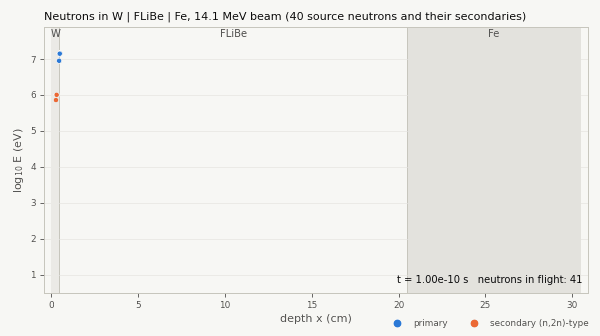
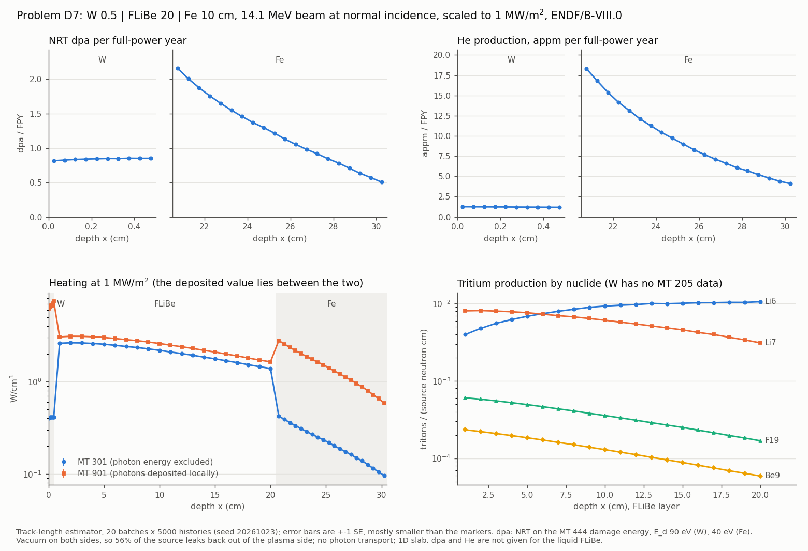
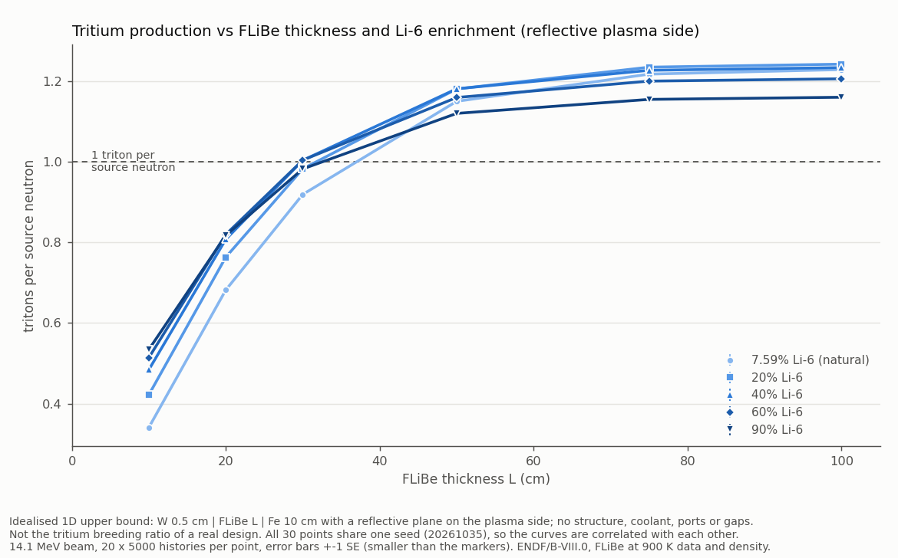
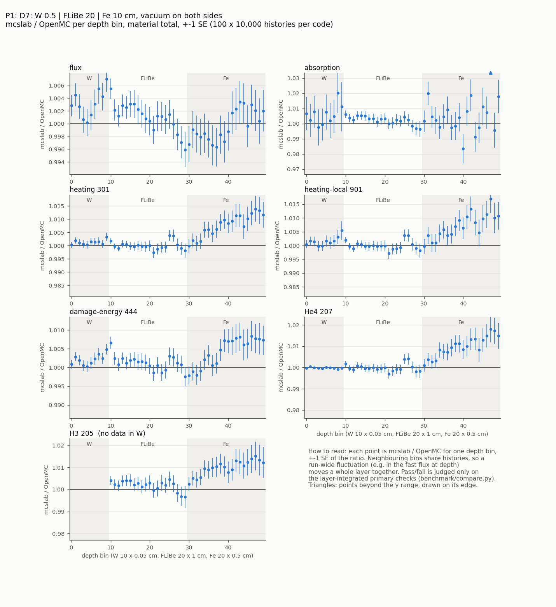
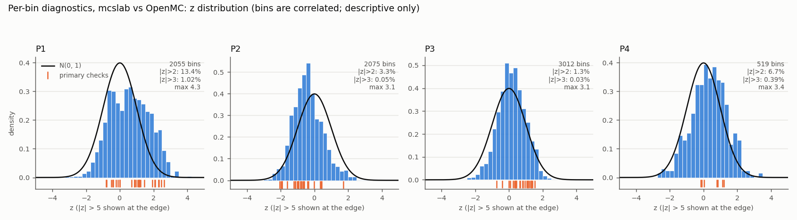

# mcslab: 1D Monte Carlo neutron transport

A 1D slab Monte Carlo neutron transport code in Python + Numba. The eventual
goal is modelling 14.1 MeV D-T fusion neutrons in a first wall / blanket
(heating, dpa, helium production, tritium breeding ratio) with ENDF/B-VIII.0
data.



*Neutron histories from a 14.1 MeV beam entering W | FLiBe | Fe: depth
against log energy over time (`scripts/animate_tracks.py`).*

## Status and open items

Phases 1 to 4 are complete. The code transports neutrons in continuous
energy with every outgoing-neutron law in the data, scores heating,
damage, helium and tritium, and agrees with OpenMC 0.16.0 on the same
data: all 82 primary benchmark checks pass (largest |z| 2.63). The rules
for seeds, statistical checks, regression references and the benchmark
failure protocol are in `docs/development.md`.

Open items and limits that affect how the results can be used:

- **The 14.1 MeV cross-section hand-check is pending.** No value has yet
  been compared by hand with an independent ENDF/B-VIII.0 source (see
  "Hand-checking cross sections").
- **Heating is a bracket, not a number.** There is no photon transport,
  so heating is reported between MT 301 and MT 901 (a factor of 16 wide
  for W and 6.5 for Fe in D7).
- **The blanket sweep is an idealised 1D upper bound, not a TBR.** A
  reflective plane returns every neutron that leaves the plasma side, and
  there is no structure, coolant, ports or gaps.
- **No unresolved-resonance probability tables.** Measured effect, from
  OpenMC with its tables on against off (P1): W absorption -0.92%
  (1.2 SE), left leakage +0.59% (3.6 SE), the other 24 quantities at most
  0.52%.
- **An unexplained per-bin excursion in benchmark problem P1.** 13.4% of
  P1's per-bin z values exceed 2 (4.6% expected), the largest is 4.33,
  and P2, with the same slab and independent seeds, shows the opposite
  sign in the Fe. No primary check failed, so it was not followed up. It
  is an open item, not established noise (see "What differs, and why").

## Current scope

### Phase 1: transport engine (one-group)

- 1D slab of contiguous regions, vacuum boundaries on both sides (units: cm).
- One-group, made-up materials (Sigma_t = Sigma_s + Sigma_a), isotropic
  lab-frame scattering. Void regions (Sigma_t = 0) are allowed.
- Sources: monodirectional beam at x = 0 (mu = 1); isotropic plane source.
- Analog transport. Tallies per region are collisions, absorptions,
  track-length flux and collision-estimator flux, plus currents in both
  directions at every region interface. Means and standard errors come from
  batch statistics.
- Reproducible per-history RNG (OpenMC-style LCG with skip-ahead). Results
  are bit-identical however the batches are split across calls or, later,
  threads.

### Phase 2a: nuclear data layer (continuous energy, lookup only)

- `mcslab/nucdata.py` reads official OpenMC HDF5 incident-neutron files
  (format 3.x) directly with h5py. The `openmc` package is not used. The
  library is a directory plus a label, so ENDF/B-VIII.0 (used now) and
  FENDL-3.2 (planned comparison) are read the same way.
- `mcslab/xs.py` does the lookup: binary search plus lin-lin interpolation,
  exactly 0 below threshold, and it refuses energies off the grid. It also
  packs the data CSR-style for the Numba kernels.
- `mcslab/ce_materials.py` defines natural W, natural Fe and FLiBe
  (Li2BeF4, with a Li-6 enrichment parameter). Densities and abundances are
  cited in the code.
- `mcslab/transport_ce.py` and `config_ce.py` form a continuous-energy
  kernel in which **the first collision ends the history**. There are no
  scattering kinematics yet; that's Phase 2b.
- `docs/data_inventory.md` is generated from the data. It lists, per
  nuclide, every reaction with its MT, thresholds, Q, sigma(14.1 MeV) and
  secondary-distribution types, plus what heating, damage and
  gas-production data exist.
- Plots of the key cross sections are in `docs/figures/`.

### Phase 2b, Part 1: collision kinematics (elastic and discrete levels)

A new continuous-energy kernel (`mcslab/transport_kin.py`, driver
`mcslab/config_kin.py`) in which neutrons scatter, lose energy and
multiply. It mirrors OpenMC v0.16.0's physics, cited in the code. The
Phase 1 and Phase 2a kernels are unchanged.

- **Collisions.** The nuclide is chosen in proportion to N sigma_t. Then
  analog absorption (capture, (n,p), (n,a), Li-6 (n,t), ...) ends the
  neutron. Otherwise an elastic or inelastic channel is chosen in
  proportion to its cross section, in OpenMC's order and draw count.
- **Elastic scattering.** Two-body kinematics with the tabulated CM angular
  distribution, target at rest.
- **Discrete inelastic levels (MT 51-90).** Two-body kinematics with the
  level's Q. The CM energy comes from AWR and Q, so energy and momentum
  are conserved to round-off. This is a documented deviation from
  OpenMC, which uses the rounded stored parameters.
- **Secondary neutrons.** Reactions with yield y > 1 bank y - 1 identical
  copies, as OpenMC does. The bank is per history and LIFO, and
  continues the history's random-number stream, so results stay
  bit-identical however batches are split.
- **Energy cutoff.** Defaults to the bottom of the data grid (1e-5 eV).
  Killed weight is never dropped silently: it is tallied per region, is a
  term in the exact neutron balance, triggers `EnergyCutoffWarning`, and is
  shown in the test summary.
- **Tallies.** The Phase 1 region and surface tallies, plus:
  - a spectrum tally (track-length and collision estimators in energy bins)
  - per-channel event and secondary counts
  - counters for the neutron balance
- **Synthetic nuclides** (`mcslab/synthetic.py`): constant cross sections,
  chosen mass, isotropic CM. Used for the analytic tests.
### Phase 2b, Part 2: every law in the data, free gas, tracks

- **Every secondary law in the W / FLiBe / Fe data** (inventory:
  `docs/law_inventory.md`, generated from the HDF5 files by
  `scripts/law_inventory.py` with h5py only):
  - correlated angle-energy (ACE law 61), in the CM frame (Fe, W) and in
    the lab frame (Be-9 (n,2n), F-19)
  - F-19 (n,2n)'s two-law applicability mixture
  - continuous tabular (ACE law 4) with tabular angles (Li-6, Li-7
    (n,2n)-type reactions)
  - energy-dependent yields (MT 5 of Fe and W)

  Each transcribes OpenMC v0.16.0's sampler, cited in the code. The driver
  refuses any problem whose nuclides have a law that is not implemented.
  None of the 14 files has one.
- **Multiplicity** (approved deviation D2). A non-integer yield y gives
  floor(y) or floor(y) + 1 neutrons, with mean y, and weights stay 1. A
  multiplicity of 0 (e.g. Fe and W MT 5 below ~6 MeV) ends the neutron.
  Its weight is tallied per region (`zero_yield_weight`) as its own term
  of the exact balance.
- **Free-gas target motion**, OpenMC's constant-cross-section model and
  rule: the target is at rest only if E >= 400 kT and A > 1, so H-1 gets
  free gas at every energy. kT is that of the data temperature.
- **Temperature is a per-material input** (`CEMaterial.temperature`,
  default 293.6 K). It selects the data temperature (250, 294, 600, 900,
  1200 or 2500 K) by OpenMC's nearest rule, within 10 K.
- **Track recording** (`KinRunConfig.n_track`) stores every event of
  chosen histories (position, direction, energy, time, family particle
  id, event type, MT). It draws no random number and touches no tally:
  results are byte-identical with it on or off.
- **Animation:** `scripts/record_tracks.py` saves tracks, and
  `scripts/animate_tracks.py` turns them into `docs/figures/tracks.gif`
  (depth vs log energy over time) and `docs/figures/tracks.png`.
- **Regression reference** for the kinematic kernel, problem D7 (below).

### Phase 3, Part A: response tallies (heating, damage, helium, tritium)

- **What is tallied.** With `KinRunConfig.depth_bins` set, the kinematic
  kernel lays uniform depth bins over each region after the fact (no added
  surfaces, no resampled distances; `mcslab/depth_mesh.py`). Every flight
  segment, including those of (n,2n) secondaries, is split across the bins
  and scores w l N_k sigma_s(E) per nuclide k and response s (track-length
  estimator). Every collision scores w N_k sigma_s(E) / Sigma_t(E) in the
  bin of its position (collision estimator). E is the flight energy, the
  pre-collision energy for the collision estimator.
- **Responses** are OpenMC v0.16.0's neutron-only scores, so Phase 4
  compares like with like (`mcslab/responses.py`):
  - heating, MT 301
  - heating-local, MT 901
  - damage-energy, MT 444
  - H3-production, MT 205
  - He4-production, MT 207
  - absorption (the kernel's own disappearance set)

  A nuclide without one of these MTs scores exactly 0, as in OpenMC. In
  these data that is MT 205 of every W isotope, which is flagged in the
  results as "no data".
- **Also tallied:** the flux, and uncollided forms of both estimators
  (source neutrons before their first collision). These are not OpenMC
  0.16.0's `CollisionFilter` bins 0 and 1, which also hold the first
  flights and first collisions of neutrons banked by (n,2n)-type reactions
  (deviation 16; Phase 3 stated the opposite). The per-layer flux spectrum
  is the existing spectrum tally on a 20-bins-per-decade grid.
- **Reproducibility.** The response cross sections are interpolated with
  the grid index and factor the transport step already computed. The
  tallies draw no random number and write only their own batch row. With
  them on, every Phase 2b output is byte-identical.
- **Post-processing** (`mcslab/postprocess.py`, pure Python, formulas in
  the docstring): NRT dpa, He appm and He/dpa (W and Fe), heating in
  W/cm^3, the heating fraction of the source energy, and tritium per
  source neutron. Everything is scaled to a 1 MW/m^2 neutron wall loading
  (4.4266e13 n/cm^2/s at 14.1 MeV) and one full-power year (365.25 d).
- **Outputs:** `scripts/phase3_results.py` writes
  `docs/phase3_results.json` and `docs/figures/phase3_profiles.png`. A
  bit-identical regression reference per problem lives in
  `tests/reference_tally/`.

### Phase 3, Part B: blanket study

- **Li-6 enrichment.** `ce_materials.flibe(li6_fraction=x)` holds the
  molar density of natural-Li FLiBe at the Janz density, because swapping
  lithium isotopes barely changes the molar volume. Only the Li isotopic
  split changes, and the mass density falls with the lighter Li-6 (-1.7%
  at 90%; `CEMaterial.mass_density`). Natural Li (`li6_fraction=None`)
  takes the unchanged path.
- **Reflective plasma side.** `KinRunConfig.reflect_left` (default
  `False`, vacuum) reflects a neutron at x = 0 specularly. It flips u,
  draws no random number, and is not a leak: the weight goes to
  `reflected_weight`, and the balance stays exact. In D7, 56% of the
  source leaks back out of the plasma side; in a torus those neutrons
  would enter another blanket. A reflective plane is the idealised
  version of that return.
- **Sweep.** `scripts/blanket_sweep.py` maps tritium per source neutron
  over FLiBe thickness x Li-6 enrichment with the reflective plasma side
  (`docs/blanket_sweep.csv`, `docs/figures/blanket_sweep.png`).

### Phase 4: benchmark against OpenMC 0.16.0

- **Benchmark.** mcslab and OpenMC 0.16.0 run the same four problems with
  the same data, densities, meshes and like-for-like settings, 1e6
  histories each. Pre-declared 3 SE checks compare the results (results
  below).
- **Two sides, files only.** `benchmark/run_mcslab.py` (mcslab's venv) and
  `benchmark/run_openmc.py` (OpenMC's own environment) exchange only
  `benchmark/problems.json` and results JSON.
- **Checks.** `benchmark/compare.py` applies the checks with numpy alone,
  so the comparison runs without OpenMC installed.

`docs/deviations_from_openmc.md` lists every known difference from OpenMC.

## Nuclear data setup

The data live outside the repository and are never committed.

```bash
scripts/fetch_data.sh                 # streams endfb80.tar.xz (3.38 GB), keeps 14 nuclides (~276 MB)
export MCSLAB_DATA=~/nuclear_data/endfb-viii.0-hdf5
```

The extracted files are checked against the sha256 sums pinned in
`scripts/checksums/endfb-viii.0.sha256`. Without `MCSLAB_DATA`, every test
that needs the data skips (111 of 208; see "Tests") and the Phase 1 tests
run as before.

## Usage

```bash
./venv/bin/python -m mcslab                                # Phase 1 demo run
./venv/bin/python -m pytest                                # all tests
./venv/bin/python tests/test_regression.py compare         # Phase 1 bit-identical regression
./venv/bin/python tests/test_regression_ce.py compare      # Phase 2a (CE) bit-identical regression
./venv/bin/python tests/test_regression_kin.py compare     # Phase 2b kinematic bit-identical regression (D7)
./venv/bin/python scripts/make_inventory.py                # regenerate docs/data_inventory.md
./venv/bin/python scripts/law_inventory.py                 # regenerate docs/law_inventory.md
./venv/bin/python scripts/plot_xs.py                       # regenerate docs/figures/*.png
./venv/bin/python scripts/hydrogen_cutoff.py               # H-1 cutoff fraction, target at rest vs free gas
./venv/bin/python scripts/record_tracks.py                 # D7 tracks -> outputs/tracks_d7.npz
./venv/bin/python scripts/animate_tracks.py                # -> docs/figures/tracks.gif, tracks.png
./venv/bin/python tests/test_regression_tally.py compare   # Phase 3 response-tally bit-identical regression
./venv/bin/python scripts/phase3_results.py                # D7 results -> docs/phase3_results.json, figure
./venv/bin/python scripts/blanket_sweep.py                 # Part B sweep -> docs/blanket_sweep.csv, figure (~2 min)
./venv/bin/python benchmark/compare.py --figures           # Phase 4: mcslab vs OpenMC checks, figures
```

A kinematic run (Phase 2b), e.g. a synthetic scatterer:

```python
from mcslab import synthetic as S
from mcslab.config_ce import MonoEnergetic
from mcslab.config_kin import KinRunConfig, run_kin
from mcslab.geometry import SlabGeometry
from mcslab.sources import BeamSource

x = S.nuclide("X", awr=12.0, elastic_b=4.0, capture_b=0.01)
cfg = KinRunConfig(SlabGeometry([0.0, 10.0], [S.SyntheticMaterial("x", (("X", 0.1),))]),
                   BeamSource(), MonoEnergetic(2.0e6), S.SyntheticLibrary({"X": x}),
                   n_batches=20, histories_per_batch=1000, energy_cutoff=1.0e3)
res = run_kin(cfg)
print(res.balance())       # exact: source + created == absorbed + leaked + cutoff + zero_yield
```

A real-data run with a material temperature and recorded tracks:

```python
import dataclasses
from mcslab import ce_materials as cm
from mcslab.nucdata import Library

flibe = dataclasses.replace(cm.flibe(temperature_K=900.0), temperature=900.0)  # 900 K data
cfg = KinRunConfig(SlabGeometry([0.0, 0.5, 20.5, 30.5], [cm.tungsten(), flibe, cm.iron()]),
                   BeamSource(), MonoEnergetic(14.1e6), Library.open(),
                   n_batches=20, histories_per_batch=5000, n_track=100)
res = run_kin(cfg)
res.tracks.save("tracks.npz")     # then: scripts/animate_tracks.py tracks.npz
```

## Phase 3 results on problem D7

Problem D7: W 0.5 cm, then FLiBe 20 cm (natural Li, 900 K data and
density), then Fe 10 cm, with a 14.1 MeV beam at normal incidence and
vacuum on both sides. 20 batches x 5000 histories (seed 20261023);
track-length estimator; mean +- SE over the 20 batches. Scaled to
1 MW/m^2 (4.4266e13 n/cm^2/s) and one full-power year (FPY, 3.15576e7 s).
NRT dpa uses E_d = 90 eV (W) and 40 eV (Fe) (ASTM E521). These are the
numbers pinned by `tests/reference_tally/kin_d7`; the full set, with every
input, is in `docs/phase3_results.json`.

| quantity | W (0-0.5 cm) | FLiBe (0.5-20.5 cm) | Fe (20.5-30.5 cm) |
|---|---|---|---|
| NRT dpa per FPY, front bin | 0.8174 +- 0.0014 | (liquid: none) | 2.161 +- 0.010 |
| NRT dpa per FPY, layer average | 0.8421 +- 0.0015 | | 1.224 +- 0.0073 |
| He appm per FPY, front bin | 1.2540 +- 0.00064 | | 18.29 +- 0.16 |
| He appm per FPY, layer average | 1.2220 +- 0.00087 | | 9.514 +- 0.068 |
| He appm per dpa, front bin | 1.535 +- 0.0026 | | 8.464 +- 0.055 |
| heating, front bin, W/cm^3: MT 301 to MT 901 | 0.404 to 6.25 | 2.61 to 3.06 | 0.423 to 2.79 |
| heating, layer average, W/cm^3: MT 301 to MT 901 | 0.410 to 6.68 | 2.10 to 2.49 | 0.226 to 1.47 |
| tritium per source neutron | 0 (no MT 205 data) | 0.2979 +- 0.0018 | 1.97e-7 +- 1.5e-9 |

- **Heating SEs** are 0.2-0.8% of each value (see the JSON).
- **Total heating / 14.1 MeV:** 0.4453 +- 0.0013 (MT 301) to
  0.6779 +- 0.0020 (MT 901).
- **Tritium per source neutron in FLiBe:** Li-6 0.1706 +- 0.0017,
  Li-7 0.1174 +- 0.00038, F-19 0.007251 +- 0.000021,
  Be-9 0.002663 +- 0.0000073.



How to read these numbers:

- **Heating is a bracket, not a number.** MT 301 leaves out the energy
  carried off by gammas. With no photon transport, that energy is simply
  missing, so MT 301 is a lower bound. MT 901 deposits the gamma energy
  where the gamma is born, which is right in total only if no gamma
  escapes, and too local because gammas travel centimetres. The deposited
  heating lies between the two.
  - In W and Fe the gap is large: gammas carry most of the energy.
  - **W heating should not be quoted as one number.** On top of the gap,
    W's MT 301 varies irregularly between the isotopes at 14.1 MeV, from
    3.9e5 eV-b (W183) to 9.4e5 eV-b (W184), while MT 901 varies by about 25%.
- **"Front bin" means the plasma side of a layer**, not the maximum. In W,
  the back of the layer sees more flux, from neutrons reflected by the
  FLiBe, so its dpa rises to 0.85 per FPY in the last bin.
- **Fe is damaged more than W even behind 20 cm of FLiBe.** At 14.1 MeV
  its damage energy cross section is about 2.7 times W's, its E_d is lower
  (40 vs 90 eV), and the flux reaching it is higher (3.06 vs 2.14 per
  source neutron per cm^2, front bins).
- **The tritium number is not a tritium breeding ratio.** D7 has vacuum on
  the plasma side, and 56% of the source leaks back out of it. In a torus
  those neutrons would enter another blanket. Part B adds a reflective
  plasma side.

## Phase 3 Part B results: reflective plasma side and blanket sweep

**D7 with a reflective plasma side** (`tests/reference_tally/kin_d7_reflect`):
the same slab, the same scaling and E_d, seed 20261035, 20 x 5000.

| quantity | W (0-0.5 cm) | FLiBe (0.5-20.5 cm) | Fe (20.5-30.5 cm) |
|---|---|---|---|
| NRT dpa per FPY, front bin | 1.317 +- 0.0071 | (liquid: none) | 2.297 +- 0.014 |
| NRT dpa per FPY, layer average | 1.297 +- 0.0056 | | 1.291 +- 0.0061 |
| He appm per FPY, front bin | 1.273 +- 0.0019 | | 18.38 +- 0.14 |
| He appm per FPY, layer average | 1.235 +- 0.0011 | | 9.547 +- 0.051 |
| He appm per dpa, front bin | 0.9667 +- 0.0048 | | 8.00 +- 0.042 |
| heating, front bin, W/cm^3: MT 301 to MT 901 | 0.539 to 14.2 | 3.93 to 4.58 | 0.434 to 3.05 |
| heating, layer average, W/cm^3: MT 301 to MT 901 | 0.532 to 15.0 | 2.93 to 3.39 | 0.231 to 1.61 |
| tritium per source neutron | 0 (no MT 205 data) | 0.6819 +- 0.0027 | 1.96e-7 +- 1.1e-9 |

- **Tritium per source neutron in FLiBe:** Li-6 0.5469 +- 0.0029, Li-7
  0.1250 +- 0.00032, F-19 0.007294, Be-9 0.002659.
- **Total heating / 14.1 MeV:** 0.6116 +- 0.0011 (301) to
  0.9131 +- 0.0013 (901).
- **What the returning neutrons do:**
  - Li-6 tritium more than triples.
  - W dpa rises by 54-61% (layer average and front bin), and W's
    local-photon heating more than doubles, from slow neutrons captured in
    W.
  - Fe, behind 20 cm of FLiBe, changes by less than 10%.

**Sweep.** The setup:
- W 0.5 cm | FLiBe L | Fe 10 cm, with a reflective plasma side.
- FLiBe at 900 K data and density.
- 20 x 5000 histories per point.
- **All 30 points share one seed (20261035)**, so the curves are
  correlated with each other.

This is an **idealised 1D upper bound**: a reflective plane returns every
neutron that leaves the plasma side, and there is no structure, coolant,
ports or gaps. It is not the breeding ratio of a real design.

Tritium per source neutron (mean +- SE):

| FLiBe L (cm) | 7.59% Li-6 (natural) | 20% Li-6 | 40% Li-6 | 60% Li-6 | 90% Li-6 |
|---|---|---|---|---|---|
| 10 | 0.3410 +- 0.0015 | 0.4220 +- 0.0018 | 0.4842 +- 0.0023 | 0.5141 +- 0.0029 | 0.5343 +- 0.0031 |
| 20 | 0.6819 +- 0.0027 | 0.7632 +- 0.0033 | 0.8074 +- 0.0026 | 0.8195 +- 0.0039 | 0.8172 +- 0.0028 |
| 30 | 0.9188 +- 0.0029 | 0.9822 +- 0.0042 | 1.0034 +- 0.0023 | 1.0037 +- 0.0041 | 0.9820 +- 0.0036 |
| 50 | 1.1495 +- 0.0039 | 1.1802 +- 0.0029 | 1.1806 +- 0.0035 | 1.1590 +- 0.0039 | 1.1196 +- 0.0038 |
| 75 | 1.2170 +- 0.0033 | 1.2342 +- 0.0031 | 1.2264 +- 0.0036 | 1.1996 +- 0.0037 | 1.1543 +- 0.0035 |
| 100 | 1.2282 +- 0.0034 | 1.2417 +- 0.0031 | 1.2331 +- 0.0037 | 1.2053 +- 0.0039 | 1.1597 +- 0.0035 |



- **Smallest thickness on this grid with tritium per source above 1:**
  - 50 cm for natural, 20% and 90% Li-6.
  - 30 cm for 40% and 60%, but only by 1.5 and 0.9 SE: not
    distinguishable from 1 at this precision.
- **Enrichment helps thin blankets and hurts thick ones.** At 10-30 cm,
  more Li-6 captures more slow neutrons. At 75-100 cm, 90% Li-6 gives the
  least tritium: with less Li-7 there is less fast Li-7(n,n't) tritium,
  and that reaction also returns a neutron.
- **The plateau** is about 1.23 per source neutron for natural to 40%
  Li-6. A real blanket loses neutrons to structure, ports and gaps, so it
  would breed less.

## Phase 4: benchmark against OpenMC 0.16.0

**Question.** Do mcslab and OpenMC give the same answers on the same
problems with the same nuclear data? The checks, seeds and settings were
fixed in `docs/phase4_plan.md` before any benchmark run. This is a
code-to-code verification: both codes read the same 14 ENDF/B-VIII.0
files, so agreement shows that the transport and tallies are implemented
the same way, not that the data match experiment.

**Answer.** Yes, within the statistics:
- All 82 primary checks pass: largest |z| 2.63, no check beyond 3 SE.
- Every exact check passes.
- No physics difference was found.
- The differences found are definitions and conventions (listed below),
  not physics.
- One pattern is unexplained: P1's per-bin z values are wider than
  independent noise, on the plasma side and in the Fe. It is an open item
  (below), not followed up because no primary check failed.

### Setup

- **OpenMC** 0.16.0 (the v0.16.0 tag, commit `617d35a5`), an osx-64 build
  running under Rosetta, in its own environment, on one thread.
  `benchmark/run_openmc.py` builds the model from `benchmark/problems.json`
  and never imports mcslab. mcslab's venv never imports openmc; the two
  sides exchange JSON files only. **No speed comparison is made**: OpenMC
  runs emulated here.
- **The same inputs, checked bit for bit.** Both result files of a problem
  carry the sha256 of the problem file and of the data, and the pytest
  checks them:
  - the same data files
  - the same per-nuclide atom densities (mcslab's kernel arrays, read back
    from OpenMC's `summary.h5`)
  - the same 50-80 depth-bin edges and the same 246-bin spectrum grid
- **Like-for-like settings.** Each is set explicitly and recorded in the
  results:
  - unresolved-resonance probability tables off (mcslab uses the smooth
    average cross sections)
  - photon transport off; survival biasing off, so there is no roulette at
    all
  - the same energy cutoff: the grid minimum, 9.999999999999999e-06 eV
  - OpenMC's nearest-temperature rule: W, Fe and H take 294 K data, FLiBe
    900 K data, so both codes use the same kT for free-gas scattering
  - free-gas threshold 400 kT
  - track-length estimators everywhere
- **OpenMC's model of a 1D slab.**
  - x-planes at the layer bounds.
  - Mirrors at y, z = +-10 m, which make the slab infinite sideways. A
    mirror changes neither the x-motion nor any path length, so OpenMC's
    per-source tallies equal mcslab's with no area factor.
  - A thin empty buffer cell left of x = 0. OpenMC checks that a source
    point is inside the geometry by pretending the neutron points along
    +z, which puts a point exactly on the x = 0 plane outside. The buffer
    gives that check somewhere to land. The neutron itself is then placed
    with its real direction, +x, so it starts in W at exactly x = 0, as
    in mcslab. With a mirror at x = 0, the buffer is never entered.
- **Problems** (100 batches x 10,000 histories in each code):

  | | geometry | plasma side | source |
  |---|---|---|---|
  | P1 | D7: W 0.5 \| FLiBe 20 \| Fe 10 cm | vacuum | 14.1 MeV beam |
  | P2 | D7 | reflective | 14.1 MeV beam |
  | P3 | W 0.5 \| FLiBe 100 \| Fe 10 cm | reflective | 14.1 MeV beam |
  | P4 | H-1, 0.0708 g/cm^3, 30 cm (free gas at every energy) | vacuum | 1 MeV beam |

- **Statistics.**
  - Each check is z = (mcslab - OpenMC) / sqrt(SE_m^2 + SE_o^2): the gap
    between the codes in units of its combined uncertainty. A check fails
    at |z| > 3, which chance alone gives about once in 370.
  - With 82 checks, the chance that at least one fails by luck is about
    20%. That is why a failure would have triggered one rerun at 4x the
    histories on a second, pre-declared seed pair. It was not needed.
  - The two codes use different random-number generators (deviation 6),
    so they cannot share random numbers whatever the seeds.

### Results

Primary checks, layer-integrated (`benchmark/results/comparison.json`
holds every value):

| problem | primary checks | beyond 3 SE | largest \|z\| | mean z | exact checks |
|---|---|---|---|---|---|
| P1 | 26 | 0 | 2.63 | +0.89 | 16/16 pass |
| P2 | 25 | 0 | 2.05 | -0.77 | 17/17 pass |
| P3 | 24 | 0 | 1.52 | +0.68 | 17/17 pass |
| P4 | 7 | 0 | 1.21 | +0.53 | 16/16 pass |

z per check (a score is the material total of the layer):

| check | P1 | P2 | P3 |
|---|---|---|---|
| W flux | +2.05 | -0.95 | +0.82 |
| W absorption | +0.85 | +0.40 | +0.32 |
| W heating 301 | +1.13 | -0.01 | -0.74 |
| W heating-local 901 | +1.13 | +0.42 | -0.01 |
| W damage-energy 444 | +1.94 | -0.63 | -0.41 |
| W He4 207 | -0.52 | -0.80 | +0.08 |
| FLiBe flux | +0.69 | -0.42 | +1.11 |
| FLiBe absorption | +0.94 | -0.95 | +1.23 |
| FLiBe heating 301 | -0.01 | -1.92 | +1.40 |
| FLiBe heating-local 901 | -0.01 | -1.99 | +1.33 |
| FLiBe damage-energy 444 | +1.22 | -0.83 | +0.25 |
| FLiBe He4 207 | -0.11 | -1.91 | +1.52 |
| FLiBe H3 205 | +0.85 | -0.97 | +1.33 |
| FLiBe H3 205, Li-6 | +1.07 | -0.70 | +1.15 |
| FLiBe H3 205, Li-7 | -0.79 | -2.05 | +1.31 |
| FLiBe H3 205, Be-9 | -0.40 | -1.15 | +0.63 |
| FLiBe H3 205, F-19 | -0.80 | -1.23 | +0.80 |
| Fe flux | -0.42 | +0.34 | +0.42 (weakest) |
| Fe absorption | +1.17 | +1.73 | +0.94 (weakest) |
| Fe heating 301 | +2.47 | -1.02 | +0.39 (weakest) |
| Fe heating-local 901 | +2.31 | -0.60 | +0.66 (weakest) |
| Fe damage-energy 444 | +1.45 | -0.37 | +0.43 (weakest) |
| Fe He4 207 | +2.63 | -1.13 | +0.38 (weakest) |
| Fe H3 205 | +2.29 | -0.76 | +0.83 (diagnostic only) |
| leakage left | +2.10 | exactly 0 in both | exactly 0 in both |
| leakage right | -0.22 | -1.62 | +1.05 |

P4 (H-1 slab): flux +0.79, absorption +0.84, heating 301 +1.12,
heating-local 901 +1.21, damage energy 444 +0.03, leakage left -0.10,
right -0.17. H-1 has no MT 205 or 207 data, so both codes score exactly 0
there (exact check), as they do for W tritium.

Selected values per source neutron (mean +- SE):

| quantity | problem | mcslab | OpenMC | mcslab / OpenMC |
|---|---|---|---|---|
| FLiBe tritium | P1 | 0.29905 +- 0.00043 | 0.29852 +- 0.00046 | 1.0018 |
| FLiBe tritium | P2 | 0.67976 +- 0.00080 | 0.68097 +- 0.00095 | 0.9982 |
| FLiBe tritium | P3 | 1.2289 +- 0.0012 | 1.2266 +- 0.0012 | 1.0018 |
| W damage energy (eV) | P1 | 4279 +- 3.2 | 4270 +- 3.3 | 1.0021 |
| FLiBe heating 301 (eV) | P1 | 5.9412e6 +- 4.1e3 | 5.9412e6 +- 3.9e3 | 1.0000 |
| right leakage | P2 | 0.46713 +- 0.00060 | 0.46837 +- 0.00049 | 0.9973 |
| H absorption | P4 | 0.57202 +- 0.00074 | 0.57120 +- 0.00063 | 1.0014 |

- **Resolution.**
  - 74 of the 82 checks have a combined relative SE below 0.5% (median
    0.16%).
  - Among them, the largest gap is P1's Fe tritium: +0.86% (2.3 SE).
  - Typically, a difference of about 0.5% would have been detected.
- **The weakest checks** are P3's Fe layer, behind 100 cm of FLiBe: few
  neutrons reach it (relative SE 3.5-12%). P3's Fe tritium has about 70
  contributing histories. It was moved to the diagnostics before the run
  (plan D38): z +0.83.



Ratio figures for the other problems: `docs/figures/phase4_ratio_P2.png`,
`_P3.png`, `_P4.png`. Spectra of both codes per layer, with their ratio:
`docs/figures/phase4_spectra_P{1-4}.png`.



### What differs, and why

No physics difference was found. The first item below is unexplained; the
others are definitions and conventions.

- **Open item: P1's per-bin excursion is unexplained** (per-bin
  diagnostics: 2055-3012 z values per fusion problem, no pass/fail).
  - In P1, the Fe layer's fast-neutron scores sit about +2 SE high per bin.
    The plasma-side region is +2 to +3.5 SE high (W flux, left leakage, the
    first FLiBe bins; largest per-bin |z| 4.33).
  - So 13.4% of P1's per-bin z values exceed 2, against 4.6% for
    independent normal noise.
  - P2 has the same slab, independent seeds and the opposite sign in the
    Fe (-0.7 to -0.9 SE per bin). Pooling P1 and P2 for Fe He-4 gives
    +1.1 SE.
  - P4 has the other vacuum plasma side, and its left leakage is at
    -0.10 SE.
  - P2, P3 and P4 have 3.3%, 1.3% and 6.7% of per-bin z beyond 2.
  - Neighbouring bins share histories, so one run-wide fluctuation (a few
    more fast neutrons reaching the Fe, say) moves every fast-neutron
    quantity in every Fe bin together. That is a possible explanation,
    not a demonstrated one.
  - It was not followed up: no primary check failed, so the failure
    protocol did not apply. A rerun of P1 in both codes on its declared
    second seed pair would separate a fluctuation from a real
    plasma-side difference; it has not been done.
  - Any real difference at P1's plasma side is below about 0.8% (the
    observed +0.33% in W flux plus 3 SE).
- **"Uncollided" means different things** (deviation 16).
  - OpenMC 0.16.0 gives neutrons banked by (n,2n)-type reactions a
    collision count of 0. Its `CollisionFilter` bin 0 therefore also holds
    their first flights: 11-19% extra in W and FLiBe, and 80% in D7's Fe.
  - Restricted to the source energy, OpenMC's uncollided flux matches
    mcslab's and the first-flight formula. Largest |z| against the
    formula per bin: 2.1 (mcslab) and 2.7 (OpenMC) in P1, P2 and P4.
  - P3 is the exception, for lack of events in its deep Fe. The largest
    |z| there is 2.1 (mcslab) and 3.4 (OpenMC, in bins with a handful of
    events). OpenMC scored no uncollided neutron in 11 Fe bins, where the
    formula expects 1.1e-6 cm of track per source neutron in all, about
    one neutron in the whole run.
- **An energy exactly on a spectrum-bin edge is binned differently**
  (deviation 17).
  - OpenMC puts it in the bin below the edge, mcslab in the bin above.
  - P4's 1 MeV source sits exactly on the grid edge 10^6 eV, so its
    uncollided neutrons land one bin apart in the two codes (|z| 836 and
    949).
  - The two bins merged agree: z = +1.59. This was found after the run;
    those two bins are reported separately and kept out of the per-bin
    statistics.
- **Mesh slivers** (deviation 14). OpenMC's mesh puts round-off slivers of
  a track (at most 1.2e-13 of the nuclide's largest bin) into the
  neighbouring layer. That is
  why the exact zeros (W tritium) are checked on per-layer cell tallies.
  OpenMC's mesh sums equal its cell tallies to 5.9e-10.
- **Fractional yields** (deviation 5). OpenMC changes the neutron's weight;
  mcslab samples whole neutrons. Same averages, different noise.

### What OpenMC's default settings would change (plan D37)

Two extra OpenMC runs each changed one like-for-like setting back to
OpenMC's default. They are compared with the main OpenMC run, two
independent runs, so each change carries the noise of both. These are
diagnostics, not checks.

**Probability tables on** (P1; the tables exist only for W-182 to W-186
at 5-100 keV and Fe-58 at 0.35-3 MeV):

| quantity | change | in SE | z against mcslab |
|---|---|---|---|
| W absorption | -0.92% | -1.21 | +2.02 |
| left leakage | +0.59% | +3.58 | -1.52 |
| Fe flux | -0.52% | -2.23 | +1.82 |
| right leakage | -0.43% | -2.16 | +1.80 |
| FLiBe tritium, Li-7 | -0.36% | -3.40 | +2.45 |
| FLiBe tritium, F-19 | -0.33% | -3.32 | +2.47 |
| FLiBe tritium, Be-9 | -0.27% | -2.72 | +2.25 |
| W damage energy 444 | +0.25% | +2.35 | -0.43 |
| the other 18 quantities | at most 0.40% | within 2 SE | within 2.3 |

- **The largest change is W absorption, -0.92% (1.2 SE).** Less
  absorption in W and a higher left leakage (+0.59%, 3.6 SE) go in the
  expected direction: the tables self-shield W's resonances, so more keV
  neutrons get through the W. The W change alone is only 1.2 SE.
- **Some changes are noise, not physics.**
  - The tables cannot change the Li-7, F-19 and Be-9 tritium. Those
    reactions need neutrons above 3.1, 9.5 and 11.6 MeV, and the tables
    act below 3 MeV.
  - So their -2.7 to -3.4 SE moves are a fluctuation between the two
    independent runs. The three are one fluctuation, since all follow the
    fast flux in the FLiBe.
  - This is an example of why a single 3 SE excursion triggers a rerun,
    not a verdict.
- **Against mcslab**, the run with the tables still passes all 26 checks
  (largest |z| 2.47). Its mean z is +1.20, against +0.89 for the main
  pair.
- **Conclusion:** in D7 the tables matter at the level of a few tenths of
  a percent, mostly in W absorption and the plasma-side leakage. One run
  does not resolve it more finely.

**Energy cutoff 0** (P4; OpenMC transports neutrons below 1e-5 eV on
extrapolated cross sections):

| quantity | change | in SE | z against mcslab |
|---|---|---|---|
| H absorption | +0.40% | +2.49 | -1.50 |
| H flux | +0.22% | +2.04 | -1.16 |
| H heating-local 901 | +0.20% | +1.97 | -0.68 |
| H heating 301 | -0.06% | -0.66 | +1.87 |
| H damage energy 444 | +0.03% | +0.46 | -0.44 |
| left leakage | -0.09% | -0.41 | +0.30 |
| right leakage | -0.11% | -0.32 | +0.13 |

- **The cutoff's real effect is too small to see.** In the main runs,
  mcslab ended 2.5e-4 neutrons per source at the cutoff. Even if every
  one of them were absorbed instead, absorption would rise by only 0.044%.
- **So the changes above are mostly noise between the two runs** (at most
  2.5 SE).
- **Against mcslab,** all 7 checks still pass (largest |z| 1.87).
- **Neither fusion problem is affected:** no weight reached the cutoff in
  P1-P3.

### Reproducing

```bash
# mcslab side (venv): the problem file, then the four problems (~2.5 min)
MCSLAB_DATA=~/nuclear_data/endfb-viii.0-hdf5 ./venv/bin/python benchmark/run_mcslab.py export
MCSLAB_DATA=~/nuclear_data/endfb-viii.0-hdf5 ./venv/bin/python benchmark/run_mcslab.py run
# OpenMC side (its own environment; one thread; about 16 min of CPU in all)
MCSLAB_DATA=~/nuclear_data/endfb-viii.0-hdf5 <openmc-env>/bin/python benchmark/run_openmc.py run
MCSLAB_DATA=... <openmc-env>/bin/python benchmark/run_openmc.py run --problem P1 --variant ptables_on
MCSLAB_DATA=... <openmc-env>/bin/python benchmark/run_openmc.py run --problem P4 --variant cutoff_0
# comparison (numpy only) and figures
./venv/bin/python benchmark/compare.py --figures
./venv/bin/python -m pytest tests/test_benchmark_openmc.py
```

- **Rerunning reproduces the committed results exactly.**
  - mcslab: `run_mcslab.py check --problem P1` reruns one problem and
    compares everything but the provenance byte for byte.
  - OpenMC: on the same build and one thread, a rerun reproduces its JSON
    byte for byte (checked for P4). Threads would change the last bits of
    OpenMC's tally sums.
- **Nothing local is committed.** Run directories, statepoints, XML and
  logs stay outside the repository. The committed JSON holds no absolute
  paths, user names, dates or timings.

## Tests: what they do and do not cover

With the nuclear data (`MCSLAB_DATA` set), all 208 tests pass. Without
it, the 111 tests that need the data skip and the other 97 pass; pytest
reports "97 passed, 58 skipped", because `tests/test_nucdata.py` (54
tests) skips as a whole and counts once. The Phase 2a and later
regression harnesses refuse to run without the data. Seeds and
thresholds of every statistical check were fixed in the phase plan
before the test existed; the rules are in `docs/development.md`.

- `tests/test_physics.py` checks the Phase 1 engine against analytic results
  (see its docstring).
- `tests/test_nucdata.py` covers Phase 2a and needs the data:
  - **(a)** On-grid lookups return the stored values bit for bit, for every
    reaction of all 14 nuclides. This tests the search and interpolation
    code, not the accuracy of the data.
  - **(b)** Grids are strictly increasing. Every reaction is exactly 0 below
    its threshold index, and at every grid energy below the kinematic
    threshold -Q(A+1)/A.
  - **(c)** **MT 1 (the total) is not stored in the OpenMC HDF5 files**, so
    "total = sum of partials" cannot be checked against an evaluated total
    here. What *is* checked:
    - No reaction is counted twice.
    - All 24 stored redundant sums (MT 4, 103-107, and Li-7 MT 205) match
      their components. The tolerance is the ENDF-format rounding bound (7
      significant digits, or 6 below 1e-9 b) plus 1e-9 b. The worst excess
      over the rounding bound is 8.5e-11 b, in sub-threshold tails of MT
      103/107, where the stored sum is nonzero below all its components'
      thresholds.
    - The kernel's pre-summed total matches the per-reaction lookups to
      3e-15 relative.

    The evaluated total itself is only checked by hand (below).
  - **(d)** A 14.1 MeV beam through 5 cm of natural iron, with the first
    collision ending the history. The test compares T with
    exp(-Sigma_t L) at 3 SE, with Sigma_t computed in the test from the raw
    HDF5 files (h5py + np.interp). This validates the lookup and sampling
    chain end to end at one energy. It does not validate any energy
    dependence of transport.
  - Also covered: the data checksums, and mean atomic masses from IUPAC
    abundances x AWR against standard atomic weights.
- `tests/test_regression_ce.py` **(e)** is a byte-exact regression of the CE
  kernel on real data: a W | void | FLiBe | Fe slab with a log-uniform
  1 keV-14.1 MeV source. Its reference (`tests/reference_ce/`) pins the
  sha256 of every data file it uses.

- `tests/test_kinematics.py` covers Phase 2b Part 1. Seeds were fixed in
  `docs/phase2b_plan.md` before the tests were written.
  - **(a)** Elastic scattering off a target at rest, synthetic isotropic-CM
    nuclide with A = 1, 12, 184. E' is uniform on [alpha E, E]
    (chi-square) and the mean ln(E/E') is xi (3 SE). Per event,
    E' = E((1+alpha) + (1-alpha) mu_cm)/2 to round-off, with mu_cm
    replayed from the event's random number.
  - **(a2)** The tabular-angle sampler on real tables (Fe56 and W184
    elastic, at on-grid and between-grid energies) and on synthetic
    histogram tables. Chi-square against probabilities computed from the
    raw HDF5 files, plus an exact inverse-CDF replay (1.7e-15).
  - **(b)** Slowing down in an infinite non-absorbing medium, through the
    full kernel. Both flux estimators follow 1/(xi Sigma_s E): a
    Hotelling T^2 test over 10 energy bins, for A = 1 (exact) and A = 12
    (8 collision intervals below the source, where the Placzek transient
    is bounded at 1.3e-8 by a deterministic solve in the test). Leakage
    is asserted to be exactly 0.
  - **(c)** Per-event energy and momentum conservation for all 98 discrete
    levels of Fe56, Li7, F19 and W184 (real angle data), synthetic levels,
    and elastic scattering: at most 7.4e-16 relative.
  - **(d)** Exact integer neutron balance in a multiplying slab with
    (n,2n) and (n,3n):
    `sources + created == absorbed + leaked + cutoff`, per batch, with
    every term cross-checked against an independent counter, and
    `created == (y-1) x events` per channel.
    - **Its multiplication is not physical.** The synthetic (n,2n) and
      (n,3n) laws give each identical copy the full two-body energy. A
      14.1 MeV (n,2n) family on A = 9 therefore carries 2 x 9.76 =
      19.5 MeV out of the 12.1 MeV available (E + Q). The secondaries
      stay above threshold and multiply again, which gives 1.31
      secondaries per source (beam) or 1.20 (isotropic source).
    - That is fine for a bookkeeping test, but do not read it as a
      physical number. The real D7 slab gives 0.26.
  - **(a2)** also rebuilds its expected probabilities from the PDF alone,
    never reading the stored CDF that the sampler uses. They must agree
    to 1e-6 per bin (worst 2.8e-7).

- `tests/test_laws.py` covers the Part 2 laws on real data. Seeds were
  fixed in the plan before the tests existed.
  - **Reader and packing.** All 301 non-redundant neutron reactions of
    the 14 nuclides read and pack exactly as the independent h5py
    inventory lists them. Edited copies of real files with unimplemented
    or malformed laws are refused, and so is a whole problem containing
    one, even below that reaction's threshold.
  - **(f), replay.** All 56 reactions with a Part 2 law, at 3 incident
    energies, 336000 events in all. Each event is replayed from its random
    numbers on raw h5py arrays:
    - E_out matches the replay to 2.6e-16 E_in.
    - The forward CDF matches the draw: 2.5e-13 for E_out, 3.0e-10 for
      mu.
    - The CM->lab transform matches to 4.4e-16.
    - The multiplicity is exact.
  - **(f), statistical.** Joint (E_out, mu) chi-squares for Fe56 MT 91,
    W184 MT 16, Be9 MT 16, F19 MT 16 and Li7 MT 16, each at an on-grid
    and a between-grid incident energy (10 checks). The reference is
    built from the PDFs alone; the stored CDF is never read.
  - **(g), MT 5 multiplicity.** Fe56 and W184 at 6 energies: n is
    floor(y) or ceil(y), and its mean equals y(E) at 3 SE. Integer yields
    draw nothing extra.
  - **(g), kernel.** On real W | Fe (30 MeV) and FLiBe (14.1 MeV) slabs,
    created == (y - 1) x events per channel, and the balance with the
    zero-yield term is exact per batch.
- `tests/test_freegas.py` covers free gas and temperatures. The docstring
  derives every expected value.
  - **Stationarity.** E_in is drawn from the collision density
    pi ~ sigma_eff(E) E exp(-E/kT). After one collision, E_out follows pi
    again (chi-square), and its mean is kT (2 - 1/(2(A+1))), for A = 1
    and 12.
    - pi is not E exp(-E/kT). The flux pi / sigma_eff is Maxwellian only
      if the tabulated cross section is sigma_eff.
  - **Kernel shape** at fixed E_in = kT and 20 kT:
    - A = 1 against the closed-form hydrogen (Wigner-Wilkins) kernel.
    - A = 12 against a kernel integrated numerically over the Maxwellian
      target, independently of the sampler.
    - Above 400 kT (A = 12), the target-at-rest path is taken, bit for
      bit.
  - **Exact checks:**
    - the dispatch rule
    - the kernel's free-gas counter
    - OpenMC's nearest-temperature selection
    - per-material packing against h5py
    - the Phase 2a driver refusing other temperatures
- `tests/test_tracks.py`:
  - Track recording on, off or truncated leaves every tally and count
    byte-identical.
  - Recorded tracks are consistent, to 1.1e-14 cm, and do not depend on
    the batch split.
  - The recorded events match the kernel's counters exactly.
- `tests/test_regression_kin.py` **(h)** is a byte-exact regression of the
  kinematic kernel on problem D7, with its own `tests/reference_kin/` and
  pinned data sha256s.
  - **Problem:** W 0.5 cm, then FLiBe 20 cm (900 K data and density),
    then Fe 10 cm, with a 14.1 MeV beam, 20 x 5000 histories.
  - **Per source:** 0.263 secondaries created, 0.322 absorbed, 0.562
    leaked left, 0.375 leaked right, 0.0046 ended by zero yield, 0 cut
    off.
  - **What it is:** a bit-identity contract, not a validation of those
    numbers.

  Not covered yet: any comparison of real-data transport results with
  OpenMC or with measurements (Phase 4), and any transport-level thermal
  spectrum test.
- `tests/test_reproducibility_kin.py`: the kinematic kernel is
  bit-identical under repeated, split and reordered batch runs with
  secondaries present. Bank overflow raises instead of dropping neutrons.

Phase 3 (seeds, thresholds and bins fixed in `docs/phase3_plan.md` before
the tests were written):

- `tests/test_tally_mesh.py` (deterministic):
  - **Splitting.** 1e5 random segments against exact rational arithmetic:
    per-bin lengths within 2.9e-16 d and sums within 2.2e-16 d (bound
    1e-12). Segments that end on a layer boundary end in its last bin.
  - **Response lookups:** bit-identical to the reader's for all 13 D7
    nuclides, and within 2.1e-16 of the raw HDF5 values.
- `tests/test_tally_reproducibility.py`:
  - D7 with the tallies on reproduces all 9 Phase 2b reference arrays
    byte for byte.
  - The tally arrays are byte-identical for split, chunked and reversed
    batch ranges, stale output rows, track recording on or off, and a
    fresh process with an empty Numba cache.
- `tests/test_tally_physics.py`: one D7 validation run (100 x 2000).
  - **First flight.** The uncollided track length in each of the 50 bins
    (50 checks) and the first-collision estimator per layer (3) are
    checked against (exp(-tau_a) - exp(-tau_b)) / Sigma_t, computed from
    the raw HDF5 files.
  - **Uncollided ratios:** uncollided response / flux equals the raw
    N sigma(14.1 MeV) to 7.3e-14.
  - **Track length vs collision estimator:** per layer for every response,
    and for FLiBe tritium per nuclide (24 checks).
  - **Track-length absorption vs analog absorptions** per layer (3
    checks). The analog side counts only histories ended by a sampled
    absorption; zero-yield and cutoff kills are excluded.
  - **Exact:** W tritium is 0, and the summed mesh tallies equal the
    region tallies to 3.9e-14.
  - **Result:** all 80 statistical checks pass, largest |n_SE| 2.15.
  - **What this does not show:** that the response *data* are right, or
    that mcslab agrees with OpenMC (Phase 4).
- `tests/test_regression_tally.py`: byte-exact references, one per problem.
  The D7 transport arrays must hash as in `tests/reference_kin`.
- `tests/test_postprocess.py`: every post-processing formula, checked
  against a hand computation.
- `tests/test_blanket.py` (Part B):
  - **Enrichment:** the natural-Li path is unchanged bit for bit; enriched
    FLiBe keeps the Be and F densities exactly and the total atom density
    to 1e-14.
  - **Reflection, exact:** in a void slab, the reflection draws no random
    number, its count equals the replayed number of backward source
    directions, and the track length equals the replayed paths to 1e-12.
    On W | FLiBe | Fe, every reflection flips u bit for bit at x = 0 with
    E unchanged, and the balance is exact with no left leakage.
  - **Reflection, statistical:** a reflective [0, 20] cm FLiBe slab equals
    the mirrored vacuum [-20, 20] cm slab in flux, absorption, leakage and
    tritium (4 checks).
    - Largest deviation: 2.53 SE (absorption), with leakage at -2.51 SE.
    - These two are nearly one fluctuation, because their sum is fixed by
      the neutron balance.
  - **Not covered:** an albedo below 1, a reflective right side, and any
    comparison of the sweep with another code.

- `tests/test_benchmark_openmc.py` (Phase 4; reads the committed results,
  runs no transport, needs no data or OpenMC; under 1 s):
  - **Exact, per problem:**
    - identical inputs in both codes: the problem file, data sha256
      against `scripts/checksums`, atom densities and mesh and spectrum
      edges bit for bit
    - the declared OpenMC version, commit and settings, seeds and sizes
    - exact zeros in both codes (W tritium, left leakage with a mirror,
      H-1 tritium and helium)
    - mcslab's exact balance; nothing lost in either code
  - **Exact, repository-wide:** no local path or user name in a committed
    benchmark file; `compare.py` imports numpy only.
  - **Statistical:** the 82 primary checks, |z| <= 3. All pass, largest
    2.63.
  - **Exceptions table:** `PROTOCOL_EXCEPTIONS` names any check that
    passed only on the failure protocol's 4x rerun. It is empty.
  - **Not covered (reported by `compare.py`, no pass/fail):**
    - the per-bin, spectrum and uncollided diagnostics
    - the default-settings runs
    - agreement with experiment

## Hand-checking cross sections against an independent source

**Status: pending.** None of the values below has yet been compared by
hand with an independent source.

These are values at 14.1 MeV from mcslab (ENDF/B-VIII.0, 294 K, lin-lin on
the NJOY grid):

| quantity | ENDF MT | mcslab value |
|---|---|---|
| Fe-56 total | 1 | 2.57908 b |
| Fe-56 (n,2n) | 16 | 0.4316 b |
| W-184 total | 1 | 5.38633 b |
| Li-6 (n,t) | 105 | 0.0258 b (25.8 mb) |
| Be-9 (n,2n) | 16 | 0.484483 b |
| Li-7 tritium production (optional, harder) | 205, or the sum of MT 52-82 | 0.300646 b |

Steps:
1. Open the NNDC ENDF retrieval and plotting tool, Sigma
   (https://www.nndc.bnl.gov/sigma/), or the IAEA ENDF database
   (https://www-nds.iaea.org/exfor/endf.htm).
2. Select the library **ENDF/B-VIII.0**, then the target (e.g. Fe-56), then
   the reaction by MT number (MF=3, cross sections).
3. Read the evaluated cross section at 1.41e7 eV. Use the tool's
   interpolated value or data table, or interpolate between the two
   tabulated points around 14.1 MeV yourself.
4. Compare. Expect agreement to about 0.1%. NJOY reconstructs the pointwise
   data to a 0.1% tolerance, and Doppler broadening at 294 K is negligible at
   14 MeV. A difference of a few percent or more means something is wrong:
   the wrong nuclide, MT, library version or units.
5. For Li-7, ENDF usually has no MT 205. Tritium comes from the breakup
   levels MT 52-82 (LR = 33), so sum those at 14.1 MeV, or use a tool that
   reports tritium production.

The exact menu names in these web tools may differ from the description
above.

### Response cross sections used by the Phase 3 tallies (14.1 MeV)

Values at the D7 data temperatures: W and Fe at 294 K, Li, Be and F at
900 K. Lin-lin on the NJOY grid.

| nuclide | 301 heating (eV-b) | 901 heating-local (eV-b) | 444 damage (eV-b) | 205 (n,Xt) (b) | 207 (n,Xa) (b) |
|---|---|---|---|---|---|
| W180 | 644991 | 9.13656e6 | 94559.3 | no data | 0.00231004 |
| W182 | 621866 | 1.01257e7 | 97064.4 | no data | 0.00137327 |
| W183 | 388748 | 1.13464e7 | 99850.5 | no data | 0.00135283 |
| W184 | 944698 | 9.62028e6 | 96310.7 | no data | 0.000658936 |
| W186 | 724359 | 9.42129e6 | 95915.4 | no data | 0.00044794 |
| Li6 | 4.86361e6 | 4.86942e6 | 12518.9 | 0.0258 | 0.577686 |
| Li7 | 3.33950e6 | 3.37124e6 | 13319.2 | 0.300646 | 0.320906 |
| Be9 | 2.91306e6 | 2.91671e6 | 19293.5 | 0.0208775 | 0.979366 |
| F19 | 3.56030e6 | 4.35250e6 | 97140.2 | 0.01303 | 0.410193 |
| Fe54 | 5.22357e6 | 1.15040e7 | 263040 | 4.07258e-9 | 0.0884604 |
| Fe56 | 1.75887e6 | 9.54478e6 | 257756 | 2.61359e-7 | 0.0436698 |
| Fe57 | 1.22002e6 | 5.65010e6 | 177274 | 1.04802e-4 | 0.0296651 |
| Fe58 | 904268 | 5.34999e6 | 258634 | 1.80315e-7 | 0.0217647 |

Dividing an eV-b value by sigma_t gives eV per collision.

- **Checkable against an ENDF evaluation:**
  - Li-6 MT 205 equals its (n,t) MT 105 exactly.
  - Li-7 MT 205 equals the sum of MT 52-82 (to 4.8e-8 b), as in the table
    above.
- **Not checkable against an evaluation.** MT 301, 444 and 901 are not
  evaluated data: NJOY's HEATR derived them, and GASPR derived MT 203-207,
  when the library was processed. An independent check needs another
  processing, for example JANIS with an ENDF/B-VIII.0 ACE library. **This
  has not been done.**
- **Data notes, reported and not adjusted:**
  - W-186's MT 444 is zero below 3997.71 eV, while the other W isotopes
    have nonzero damage energy from capture recoil at thermal energies.
  - The W isotopes have no MT 205 at all.
  - No 301, 901 or 444 value is negative, and 901 >= 301 at every grid
    point.

## Limitations

### Phase 1
- One energy group, made-up cross sections, isotropic lab-frame scattering only.
- Analog only: no variance reduction. The particle weight is carried but is always 1.
- Serial execution. The batch loop is structured for `prange`, but it has not
  been parallelised or tested multithreaded.
- Bit-identity holds on the same platform with the same numpy/numba/llvmlite.
  `log` may differ in the last bit across platforms or library versions.
- If a history uses more than `STRIDE` (152917) random numbers, its stream
  overlaps the next history's. That doesn't break reproducibility, but the
  streams are no longer independent. The kernel records the maximum draws per
  history so this can be checked.
- Standard errors come from batch means and assume batches are i.i.d. and
  approximately normal (at least 20 batches recommended).

### Phase 2a
- **No scattering kinematics in the Phase 2a kernel.** In
  `transport_ce.py` every collision ends the history, and a neutron keeps
  its source energy until it collides or leaks. Its results are
  uncollided-flux quantities only. The Phase 2b kernel adds kinematics.
- **294 K cross sections only.** Other temperatures in the files are
  readable but unused, and there is no on-the-fly Doppler broadening.
- **FLiBe temperature mismatch.** The default FLiBe density is the Janz
  correlation at 973 K (1.938 g/cm^3), but its Li, Be and F cross sections
  are at 294 K. At 14 MeV the Doppler effect is negligible. At low
  energies (resonances, thermal) this mismatch is real and is not corrected.
- **No unresolved-resonance probability tables.** URR tables exist in the
  files for Fe58 and W182-186 but are not used, so there is no self-shielding
  in the unresolved range. Measured in Phase 4 (OpenMC, P1, tables on
  against off): W absorption -0.92% (1.2 SE), left leakage +0.59%
  (3.6 SE), the other 24 quantities at most 0.52%.
- **No thermal scattering (S(alpha,beta))**, no unionized energy grid, no
  fission (none of the nuclides fission), and no photon transport.
- **Materials.** W and Fe densities are room-temperature handbook values.
  Natural lithium uses the IUPAC representative composition. Real lithium
  varies, and IUPAC's standard atomic weight for Li is an interval.
- **Validated at 14.1 MeV only.** Test (d) is a single-energy, uncollided
  check. The evaluated total cross section is compared with an independent
  source only through the manual hand-check above, which has not yet been
  done.
- **(Tallied in Phase 3.) Tritium, heating and damage** data are inventoried but not yet tallied.
  For Li-7, tritium production is only available as the redundant MT 205
  (see `docs/data_inventory.md`).
- **FENDL-3.2** is supported by the reader in principle, but it has not been
  fetched or tested.

### Phase 2b, Part 1
- **(Fixed in Part 2.) No thermal treatment: the target was always at
  rest.** Neutrons did not thermalise; they kept slowing down until the
  energy cutoff (1e-5 eV) killed them. In weakly absorbing media this was
  most of the neutrons.
  - **Example:** a 30 cm slab of pure H-1 at 0.0708 g/cm^3 (294 K cross
    sections), 1 MeV beam, 10 batches x 1000 histories, seed 3, lost
    69.41% of the source weight to the cutoff.
  - **With free gas** (`scripts/hydrogen_cutoff.py`, identical inputs),
    the balance is exact in both runs:

    | run | absorbed | leaked left | leaked right | cutoff (fraction) |
    |---|---|---|---|---|
    | target at rest (Part 1) | 1013 | 1421 | 625 | 6941 (0.6941) |
    | free gas (Part 2) | 5748 | 3006 | 1245 | 1 (0.0001) |

    The one remaining neutron is the sub-1e-5 eV tail of the thermal
    population, which OpenMC would keep transporting.
  - **Cause.** With the target at rest, no collision can raise a
    neutron's energy. Hydrogen removes on average a factor e per
    collision, so a neutron at 1 eV reaches 1e-5 eV in about 11.5
    collisions, each with at most a 1.4% chance of capture.
  - **With target motion** (Part 2's free gas, as in OpenMC), collisions
    below a few kT raise the energy as often as they lower it. Neutrons
    then settle into a thermal population near kT = 0.025 eV and end by
    absorption or leakage instead.
  - **Not a physical material.** 0.0708 g/cm^3 is the density of liquid
    H2, and real hydrogen is cold and molecular, so its thermal
    scattering would need S(alpha,beta) data. The 294 K data's elastic
    cross section is already Doppler-broadened (1160 b at 1e-5 eV), but
    broadening the cross section moves no energy. Only target motion in
    the kinematics does.

  Part 1 results below about 1 eV were not physical. The lost weight was
  always reported, never hidden.
- **Energy cutoff instead of extrapolating below the data grid.** This
  deviates from OpenMC, which has a zero cutoff and extrapolates.
- **(n,2n)-type secondaries are identical copies** of the outgoing neutron
  (same energy and direction), as in OpenMC. Mean values are unaffected;
  the copies are fully correlated.

### Phase 2b, Part 2
- **Free gas only; no S(alpha,beta).** Target motion is OpenMC's
  constant-cross-section free gas, with resonance scattering (DBRC/RVS)
  off, as in OpenMC's defaults. None of these materials has thermal
  scattering data in ENDF/B-VIII.0. Hydrogen is treated as a free gas of
  protons, not as H2.
- **Temperature.** Only OpenMC's default "nearest" rule: no interpolation
  between data temperatures, no multipole, no on-the-fly broadening. A
  material more than 10 K from 250, 294, 600, 900, 1200 or 2500 K is
  refused. `flibe()`'s temperature argument still sets only its density.
- **Validated by unit-level and synthetic checks only.**
  - What is checked: every new law is checked per event and statistically
    against the raw tables, free gas against analytic kernels, and the
    real-data runs for exact balance.
  - What is not: no real-data transport result has been compared with
    OpenMC or experiment yet (Phase 4). The D7 reference pins the code's
    behaviour; it does not show the numbers are right.
- **Multiplicity variance differs from OpenMC** (D2): analog integer
  sampling, not weight x yield. Means agree.
- **No event limit per particle** (OpenMC stops at 1e6 events). A neutron
  in a large non-absorbing medium could scatter for a very long time.
- **Photons are ignored**, including photon products of every reaction.
  So are the charged particles and recoils of (n,n'alpha)t and the like:
  tritium and gas production are not tallied yet (Phase 3; now tallied as
  expected values from the MT 205 / 207 data, but the charged particles
  are still not transported).

### Phase 3, Part A
- **No photon transport.** MT 301 (gamma energy lost) and MT 901 (gamma
  energy deposited locally) bracket the deposited heating. Neither is the
  answer, and in D7 the bracket is a factor of 16 (W) and 6.5 (Fe) wide.
  W heating in particular should be quoted as the bracket: its MT 301
  varies irregularly between the isotopes (3.9e5 to 9.4e5 eV-b at
  14.1 MeV).
- **1D slab, beam at normal incidence.** Real plasma neutrons arrive at
  all angles, which raises near-surface rates at the same wall loading.
  D7 leaks 56% of its source back out of the plasma side, so its tritium
  number is not a breeding ratio.
- **NRT dpa:**
  - It is applied to the energy-integrated damage energy, so NRT's
    low-energy steps are not modelled, and there is no arc-dpa
    correction.
  - The E_d values (90 eV for W, 40 eV for Fe, ASTM E521) are a choice,
    and dpa scales as 1/E_d.
  - The E_d that NJOY used inside MT 444 is not recorded in the data
    files.
  - W-186's MT 444 starts at 4 keV in the data.
- **Expected-value scoring.** Tritium, helium, heating and damage are
  expected values from the processed response data. No triton, alpha or
  recoil is transported, and no damage cascade is simulated.
- **No URR probability tables** (as before); they would change Fe-58 and W
  self-shielding in the keV-MeV range. The measured effect in D7 is a few
  tenths of a percent (Phase 4, "What OpenMC's default settings would
  change").
- **Statistics.** README standard errors come from 20 batches. The
  validation tests use 100.
- **Not validated against experiment.** The tests show that the tallies
  score the data consistently and reproducibly. Phase 4 shows that they
  agree with OpenMC on the same data. Neither shows that the data are
  right.

### Phase 3, Part B
- **The reflective plane is an idealisation.** It returns every neutron
  that leaves the plasma side, with its energy unchanged and its direction
  mirrored. A real torus returns fewer neutrons, with a softened spectrum
  and a different angular distribution. Results with it are upper bounds
  for tritium and overestimates of the low-energy return to the first
  wall.
- **The sweep is 1D:** no structure, coolant, ports, gaps or
  multiplier/breeder separation; it is not a TBR of any design. All points
  share one seed, so the curves are correlated: differences between
  neighbouring points are smoother than their SEs suggest.
- **Enriched FLiBe density:** the molar density is held at the natural-Li
  Janz value. That is an assumption; no density data for enriched FLiBe
  were used.

### Phase 4
- **Same data on both sides.** The benchmark verifies the transport and
  tally code, not the nuclear data. A shared data error would not show.
- **Like-for-like, not default, OpenMC.** OpenMC ran with probability
  tables off and mcslab's energy cutoff. Its defaults move D7 results by a
  few tenths of a percent (probability tables; see the Phase 4 results)
  and are not what mcslab computes.
- **Resolution.** About 0.5% for most quantities (1e6 histories per code),
  far worse in P3's Fe layer (3.5-12%). Smaller differences, such as the
  5e-7 level-kinematics deviation, are not tested.
- **One build.** OpenMC 0.16.0 only, an osx-64 build under Rosetta on one
  machine. The results reproduce byte for byte on that build with one
  thread; another build or platform may differ in the last bits.
- **Not covered:**
  - surface currents at a mirror (both codes give 0 net current there, by
    different bookkeeping; deviation 15)
  - isotropic sources
  - any problem with an S(alpha,beta) table, fission or photons
- **Statistical checks.** The 82 checks share histories within a problem,
  so they are positively correlated. The 20% false-alarm figure is an
  upper bound.
