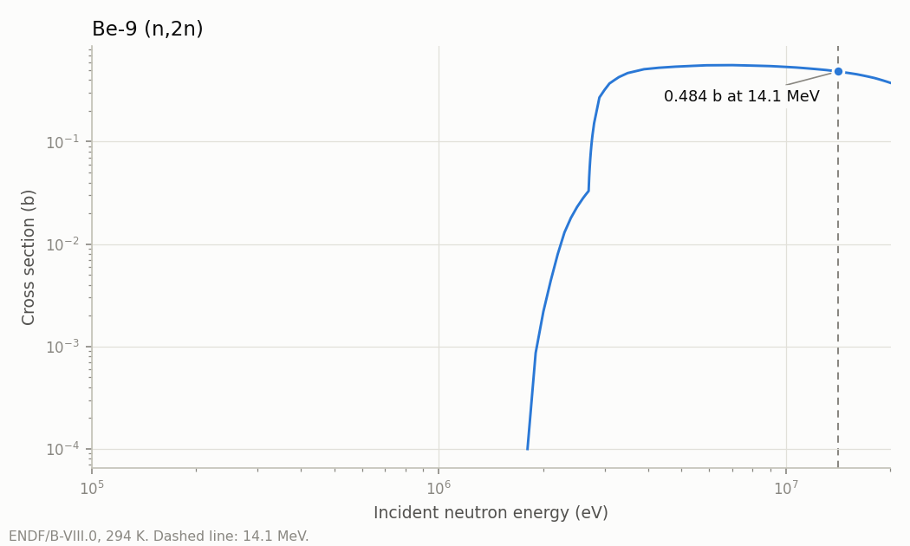
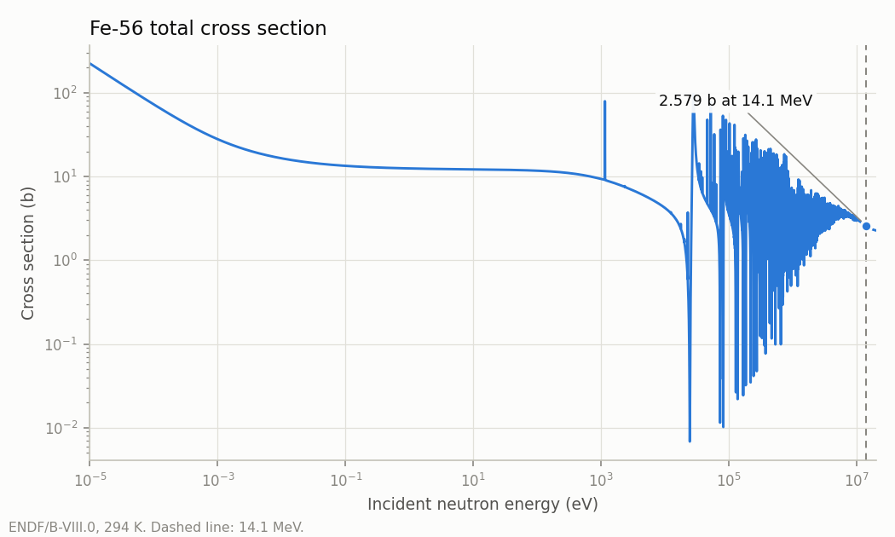
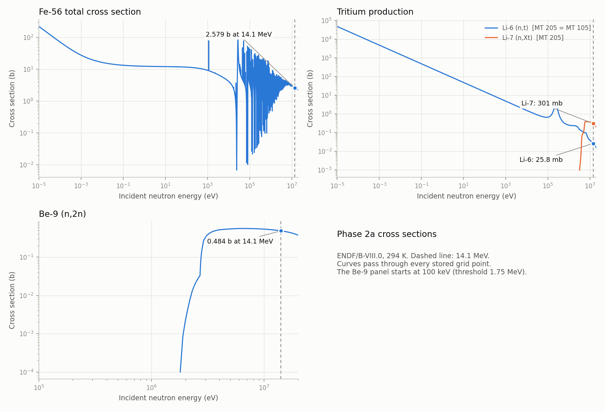
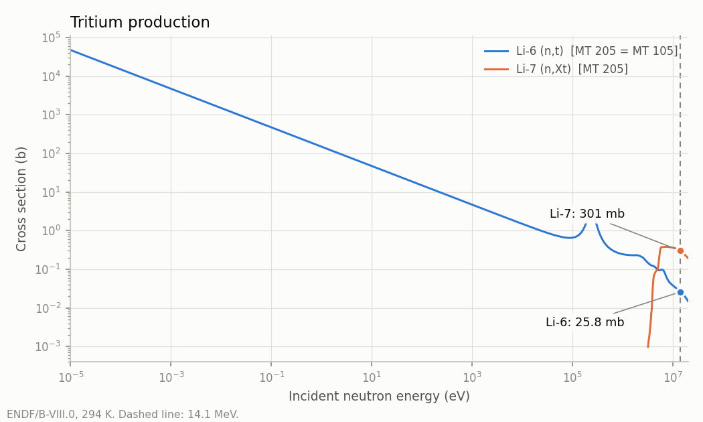

# Nuclear data inventory (Phase 2a)

Generated by `scripts/make_inventory.py` from **ENDF/B-VIII.0** (official OpenMC HDF5 library, NJOY 2016.68 -> ACE -> HDF5), at **294 K**. Every number below is read from, or computed from, these files:

| file | sha256 |
|---|---|
| `neutron/H1.h5` | `5252b5e931c7d5aa6bab34867e77b158b9d3dafbf99ecd5c6758379955eebe2b` |
| `neutron/Fe54.h5` | `9342a61e06c94428ff860e9d3e35179575897da9036cbbbb9312f4224b879b65` |
| `neutron/Fe56.h5` | `afda738f1ce679b7c528ecf12414c5a3dc3b34dd1e9f5db7f4573c89f3a40fd4` |
| `neutron/Fe57.h5` | `db2c4825ba74f476c1a839e4c5df283f61fc56a8cf28ad157307111c02a90ddd` |
| `neutron/Fe58.h5` | `c71d1d63304b50f5cf1400afc9eda5185596645d6e9d6d730f89da5a3f2419dd` |
| `neutron/W180.h5` | `7de5126bb2090cd95add7f37e38997d02657600bf66738bb7e601d34ec44bf27` |
| `neutron/W182.h5` | `edbbdbd4166ae03411f00ade36d7c8b0837da6ffd9c6ad144cb18bedfdb770c1` |
| `neutron/W183.h5` | `10973e7cbbc34362172b34f1b171b44f06622d2e6f0819d5599802e43007d686` |
| `neutron/W184.h5` | `d845cab7f30dd7ba81d48edfe8353534b4cb2ddde5b5cec1c027a650e3c8b240` |
| `neutron/W186.h5` | `41cbd1b9a9e4d887013807890ed720dbb66a086570b90cc6c12cf64ff8f48070` |
| `neutron/Li6.h5` | `8399d640c224ed4d348a688e85017e5545040df1e38dbf45ab31d28c8827218b` |
| `neutron/Li7.h5` | `a2a5a7a5901628c711d6e4085429bd46855bd8239f1ec9889b007f25d0e0f015` |
| `neutron/Be9.h5` | `2ccad4289825e558489fd0c7ddf7c796e2c2e0785ace6589c7ba5c3351eda9b0` |
| `neutron/F19.h5` | `07f3ed44a951e453058e65e79a688ce96f4a20b189d3827c0b618a96e3b5a0ac` |

This inventory decides what Phase 2b (kinematics) and Phase 3 (heating, damage, gas production, TBR) must implement.

## Key findings

1. **MT 1 (total) is not stored** in any of the 14 files. MT 3 and MT 101 aren't either. OpenMC's HDF5 writer drops redundant reactions except a keep-list (MT 4, 16, 103-107, 203-207, 301, 444, 901). mcslab defines the total as the sum of the non-redundant reactions, as OpenMC does.
2. **Interpolation.** The attributes found on any `reactions/*/<T>/xs` dataset are ['threshold_idx']. On `energy/<T>` they are none. No interpolation law is stored for reaction cross sections. They are the NJOY-linearised pointwise data, which are interpolated lin-lin (ACE format manual LA-UR-19-29016, ESZ block). The reader refuses any other attribute. The only explicit laws in the files are on secondary distributions and URR tables.
3. **Grids.** All 14 grids are strictly increasing, with no duplicate points. Every reaction's first tabulated value (at `threshold_idx`) is exactly 0, so the threshold rule and lin-lin interpolation agree, and the summed total can be interpolated directly.
4. **Upper energy.** Fe and W are tabulated to 150 MeV. H1, Li, Be and F go to 20 MeV.
5. **Unresolved resonances.** URR probability tables are present for Fe58 (3.5e+05-3e+06 eV, interpolation 2), W182 (1e+04-1e+05 eV, interpolation 2), W183 (5000-4.5e+04 eV, interpolation 2), W184 (1e+04-1e+05 eV, interpolation 2), W186 (1e+04-1e+05 eV, interpolation 2). mcslab does not use them yet, so the unresolved range is treated with smooth (infinite-dilution) cross sections. At 14.1 MeV this has no effect.
6. **Heating, damage and gas production are present for every nuclide** as redundant reactions (tables below). MT 301 and 901 are KERMA-type heating, and MT 444 is damage energy. All three are stored as energy x cross section in eV-barn, so dividing by sigma_t gives eV per collision. In OpenMC's convention, 301 (`heating`) excludes the energy of emitted photons, which are transported, and 901 (`heating-local`) deposits it locally. MT 203-207 are gas-production cross sections in barns, multiplicity-weighted.
7. **Li-7 tritium production** is only available as the redundant MT 205. No non-redundant Li-7 reaction produces a triton explicitly. ENDF/B-VIII.0 represents Li-7(n,n't)alpha as the inelastic levels MT 52-82, whose residual breaks up (LR = 33 in ENDF). The HDF5 files do not keep the LR flag. The check below shows MT 205 = sum of MT 52-82 (all Li-7 levels above n1) to within ENDF rounding. MT 51 is a bound state (0.478 MeV) and is excluded. **Phase 3 TBR must score MT 205** (or MT 52-82 as a set) for Li-7, not a single (n,t) channel. For Li-6, MT 205 = MT 105 exactly.

Li-7 check: max |MT205 - sum(MT 52-82)| = 4.830e-08 b over 791 grid points (max relative 2.27e-07). Including MT 51 gives a max difference of 0.289 b, so MT 51 is excluded.

## Summary per nuclide

| nuclide | AWR | grid points | E range (eV) | reactions (non-redundant) | URR | sigma_t(14.1 MeV) b |
|---|---|---|---|---|---|---|
| H1 | 0.99917 | 631 | 1e-05 - 2e+07 | 6 (2) | no | 0.68303 |
| Fe54 | 53.47624 | 36490 | 1e-05 - 1.5e+08 | 85 (75) | no | 2.5077 |
| Fe56 | 55.45443 | 42087 | 1e-05 - 1.5e+08 | 85 (75) | no | 2.5791 |
| Fe57 | 56.44629 | 12130 | 1e-05 - 1.5e+08 | 88 (78) | no | 2.5687 |
| Fe58 | 57.43560 | 21337 | 1e-05 - 1.5e+08 | 84 (73) | yes | 2.6597 |
| W180 | 178.40100 | 2495 | 1e-05 - 1.5e+08 | 56 (49) | no | 5.3173 |
| W182 | 180.38500 | 39899 | 1e-05 - 1.5e+08 | 64 (57) | yes | 5.3385 |
| W183 | 181.37900 | 52631 | 1e-05 - 1.5e+08 | 69 (62) | yes | 5.4894 |
| W184 | 182.37100 | 29449 | 1e-05 - 1.5e+08 | 33 (26) | yes | 5.3863 |
| W186 | 184.35700 | 27374 | 1e-05 - 1.5e+08 | 31 (24) | yes | 5.3113 |
| Li6 | 5.96182 | 797 | 1e-05 - 2e+07 | 43 (36) | no | 1.4432 |
| Li7 | 6.95573 | 791 | 1e-05 - 2e+07 | 45 (38) | no | 1.4365 |
| Be9 | 8.93478 | 644 | 1e-05 - 2e+07 | 19 (8) | no | 1.5219 |
| F19 | 18.83500 | 2322 | 1e-05 - 2e+07 | 38 (31) | no | 1.7635 |

## Heating, damage and gas production at 14.1 MeV

MT 301/901/444 are shown as the stored value (eV-b) / sigma_t = eV per collision. MT 203-207 are cross sections in barns. A dash means the reaction is not in the file.

| nuclide | 301 heating | 901 heating-local | 444 damage | 203 (n,Xp) | 204 (n,Xd) | 205 (n,Xt) | 206 (n,X3He) | 207 (n,Xa) |
|---|---|---|---|---|---|---|---|---|
| H1 | 7.151 MeV | 7.151 MeV | 0.0006339 MeV | - | 2.952e-05 | - | - | - |
| Fe54 | 2.083 MeV | 4.587 MeV | 0.1049 MeV | 0.8126 | 0.003482 | 4.073e-09 | 3.688e-06 | 0.08846 |
| Fe56 | 0.682 MeV | 3.701 MeV | 0.09994 MeV | 0.1498 | 0.0009356 | 2.614e-07 | 1.34e-09 | 0.04367 |
| Fe57 | 0.4749 MeV | 2.2 MeV | 0.06901 MeV | 0.05835 | 0.001299 | 0.0001048 | 3.536e-11 | 0.02967 |
| Fe58 | 0.34 MeV | 2.011 MeV | 0.09724 MeV | 0.03316 | 0.0001824 | 1.803e-07 | 7.077e-14 | 0.02176 |
| W180 | 0.1213 MeV | 1.718 MeV | 0.01778 MeV | 0.006144 | - | - | - | 0.00231 |
| W182 | 0.1165 MeV | 1.897 MeV | 0.01818 MeV | 0.003415 | - | - | - | 0.001373 |
| W183 | 0.07082 MeV | 2.067 MeV | 0.01819 MeV | 0.004278 | - | - | - | 0.001353 |
| W184 | 0.1754 MeV | 1.786 MeV | 0.01788 MeV | 0.002492 | - | - | - | 0.0006589 |
| W186 | 0.1364 MeV | 1.774 MeV | 0.01806 MeV | 0.001232 | - | - | - | 0.0004479 |
| Li6 | 3.37 MeV | 3.374 MeV | 0.008674 MeV | 0.08434 | 0.4736 | 0.0258 | - | 0.5777 |
| Li7 | 2.325 MeV | 2.347 MeV | 0.009272 MeV | 6.556e-05 | 0.03039 | 0.3006 | - | 0.3209 |
| Be9 | 1.914 MeV | 1.916 MeV | 0.01268 MeV | 0 | 0 | 0.02088 | - | 0.9794 |
| F19 | 2.019 MeV | 2.468 MeV | 0.05508 MeV | 0.08041 | 0.02221 | 0.01303 | - | 0.4102 |

## Figures

## Reactions per nuclide

Columns:
- **grid thr**: the first tabulated energy (at `threshold_idx`).
- **kin thr**: -Q(A+1)/A for Q < 0.
- **frame**: the frame of the secondary distributions (CM or lab).
- **outgoing neutrons**: yield x distribution type.

For redundant reactions, Q is stored as 0 and carries no meaning.

### H1  (Z=1, A=1, AWR=0.99917, 631 points)

| MT | label | redundant | Q (MeV) | grid thr (MeV) | kin thr (MeV) | sigma(14.1 MeV) b | frame | outgoing neutrons |
|---|---|---|---|---|---|---|---|---|
| 2 | (n,elastic) |  | 0 | 1e-11 |  | 0.683 | CM | 1 x uncorrelated(angle=tabular, energy=none) |
| 102 | (n,gamma) |  | 2.22465 | 1e-11 |  | 2.952e-05 | lab | +1 photon |
| 204 | (n,Xd) | yes |  | 1e-11 |  | 2.952e-05 | lab | none |
| 301 | heating | yes |  | 1e-11 |  | 4.884e+06 eV-b | CM | none |
| 444 | damage-energy | yes |  | 1e-11 |  | 433 eV-b | lab | none |
| 901 | heating-local | yes |  | 1e-11 |  | 4.885e+06 eV-b | CM | none |

### Fe54  (Z=26, A=54, AWR=53.47624, 36490 points)

| MT | label | redundant | Q (MeV) | grid thr (MeV) | kin thr (MeV) | sigma(14.1 MeV) b | frame | outgoing neutrons |
|---|---|---|---|---|---|---|---|---|
| 2 | (n,elastic) |  | 0 | 1e-11 |  | 1.113 | CM | 1 x uncorrelated(angle=tabular, energy=none) |
| 5 | (n,misc) |  | 0.8435 | 0.0009375 |  | 0.5538 | CM | Tabulated1D yield x correlated +1 photon |
| 16 | (n,2n) |  | -13.378 | 13.6282 | 13.6282 | 0.00162 | CM | 2 x correlated +1 photon |
| 51 | (n,n1) |  | -1.40819 | 1.43452 | 1.43452 | 0.03561 | CM | 1 x uncorrelated(angle=tabular, energy=level) +1 photon |
| 52 | (n,n2) |  | -2.5381 | 2.58556 | 2.58556 | 0.004838 | CM | 1 x uncorrelated(angle=tabular, energy=level) +2 photon |
| 53 | (n,n3) |  | -2.5613 | 2.6092 | 2.6092 | 0.002169 | CM | 1 x uncorrelated(angle=tabular, energy=level) +2 photon |
| 54 | (n,n4) |  | -2.9492 | 3.00435 | 3.00435 | 0.0001571 | CM | 1 x uncorrelated(angle=tabular, energy=level) +3 photon |
| 55 | (n,n5) |  | -2.959 | 3.01433 | 3.01433 | 0.008342 | CM | 1 x uncorrelated(angle=tabular, energy=level) +3 photon |
| 56 | (n,n6) |  | -3.166 | 3.2252 | 3.2252 | 0.0009339 | CM | 1 x uncorrelated(angle=tabular, energy=level) +3 photon |
| 57 | (n,n7) |  | -3.2948 | 3.35641 | 3.35641 | 0.05876 | CM | 1 x uncorrelated(angle=tabular, energy=level) +4 photon |
| 58 | (n,n8) |  | -3.3448 | 3.40735 | 3.40735 | 0.0004551 | CM | 1 x uncorrelated(angle=tabular, energy=level) +4 photon |
| 59 | (n,n9) |  | -3.4374 | 3.50168 | 3.50168 | 0.01272 | CM | 1 x uncorrelated(angle=tabular, energy=level) +5 photon |
| 60 | (n,n10) |  | -3.7938 | 3.86475 | 3.86474 | 0.0001871 | CM | 1 x uncorrelated(angle=tabular, energy=level) +4 photon |
| 91 | (n,nc) |  | -2.47816 | 2.5245 | 2.5245 | 0.367 | CM | 1 x correlated +1 photon |
| 102 | (n,gamma) |  | 9.29843 | 1e-11 |  | 0.0009967 | lab | +1 photon |
| 103 | (n,p) | yes |  | 0.699832 |  | 0.3389 | lab | none |
| 107 | (n,a) | yes |  | 0.0009375 |  | 0.003737 | lab | none |
| 111 | (n,2p) |  | -7.474 | 7.61376 | 7.61376 | 0.004148 | lab | +1 photon |
| 203 | (n,Xp) | yes |  | 0.699832 |  | 0.8126 | lab | none |
| 204 | (n,Xd) | yes |  | 5.5 |  | 0.003482 | lab | none |
| 205 | (n,Xt) | yes |  | 5.5 |  | 4.073e-09 | lab | none |
| 206 | (n,X3He) | yes |  | 5.5 |  | 3.688e-06 | lab | none |
| 207 | (n,Xa) | yes |  | 0.0009375 |  | 0.08846 | lab | none |
| 301 | heating | yes |  | 1e-11 |  | 5.224e+06 eV-b | CM | none |
| 444 | damage-energy | yes |  | 1e-11 |  | 2.63e+05 eV-b | lab | none |
| 600 | (n,p0) |  | 0.0854 | 0.699832 |  | 0.0001783 | lab | none |
| 601 | (n,p1) |  | 0.03053 | 0.699832 |  | 0.000149 | lab | +1 photon |
| 602 | (n,p2) |  | -0.0709 | 0.699832 | 0.0722258 | 0.0001825 | lab | +1 photon |
| 603 | (n,p3) |  | -0.28289 | 0.699832 | 0.28818 | 0.0001637 | lab | +3 photon |
| 604 | (n,p4) |  | -0.32215 | 0.699832 | 0.328174 | 0.0001728 | lab | +5 photon |
| 605 | (n,p5) |  | -0.75351 | 0.767601 | 0.767601 | 0.0001724 | lab | +6 photon |
| 606 | (n,p6) |  | -0.92422 | 0.941503 | 0.941503 | 0.0001644 | lab | +4 photon |
| 607 | (n,p7) |  | -0.9879 | 1.00637 | 1.00637 | 0.0001224 | lab | +5 photon |
| 608 | (n,p8) |  | -1.05134 | 1.071 | 1.071 | 0.0001524 | lab | +9 photon |
| 609 | (n,p9) |  | -1.28959 | 1.31371 | 1.31371 | 0.0001591 | lab | +8 photon |
| 610 | (n,p10) |  | -1.3056 | 1.33002 | 1.33001 | 8.858e-05 | lab | +2 photon |
| 611 | (n,p11) |  | -1.369 | 1.3946 | 1.3946 | 8.809e-05 | lab | +3 photon |
| 612 | (n,p12) |  | -1.3754 | 1.40112 | 1.40112 | 0.0001629 | lab | +6 photon |
| 613 | (n,p13) |  | -1.423 | 1.44961 | 1.44961 | 0.0001325 | lab | +10 photon |
| 614 | (n,p14) |  | -1.4586 | 1.48588 | 1.48588 | 0.0001321 | lab | +1 photon |
| 615 | (n,p15) |  | -1.5488 | 1.57776 | 1.57776 | 0.000131 | lab | +8 photon |
| 616 | (n,p16) |  | -1.5657 | 1.59498 | 1.59498 | 8.655e-05 | lab | +2 photon |
| 617 | (n,p17) |  | -1.5936 | 1.6234 | 1.6234 | 3.158e-05 | lab | +1 photon |
| 618 | (n,p18) |  | -1.698 | 1.72975 | 1.72975 | 7.746e-05 | lab | +7 photon |
| 619 | (n,p19) |  | -1.6991 | 1.73087 | 1.73087 | 8.55e-05 | lab | +11 photon |
| 620 | (n,p20) |  | -1.7676 | 1.80065 | 1.80065 | 0.000152 | lab | +20 photon |
| 621 | (n,p21) |  | -1.8369 | 1.87125 | 1.87125 | 8.441e-05 | lab | +12 photon |
| 622 | (n,p22) |  | -1.8399 | 1.87431 | 1.87431 | 7.592e-05 | lab | +7 photon |
| 623 | (n,p23) |  | -1.9706 | 2.00745 | 2.00745 | 0.0001259 | lab | +1 photon |
| 624 | (n,p24) |  | -2.0244 | 2.06226 | 2.06226 | 8.291e-05 | lab | +4 photon |
| 625 | (n,p25) |  | -2.0276 | 2.06552 | 2.06552 | 0.0001525 | lab | +7 photon |
| 626 | (n,p26) |  | -2.04847 | 2.08678 | 2.08678 | 8.272e-05 | lab | +15 photon |
| 627 | (n,p27) |  | -2.05073 | 2.08908 | 2.08908 | 8.27e-05 | lab | +3 photon |
| 628 | (n,p28) |  | -2.1486 | 2.18878 | 2.18878 | 0.0001506 | lab | +1 photon |
| 629 | (n,p29) |  | -2.18219 | 2.223 | 2.223 | 0.0001233 | lab | +11 photon |
| 630 | (n,p30) |  | -2.1946 | 2.23564 | 2.23564 | 0.000135 | lab | +1 photon |
| 631 | (n,p31) |  | -2.20617 | 2.24743 | 2.24743 | 0.000123 | lab | +5 photon |
| 632 | (n,p32) |  | -2.2346 | 2.27639 | 2.27639 | 0.0001344 | lab | +1 photon |
| 633 | (n,p33) |  | -2.26913 | 2.31156 | 2.31156 | 0.0001222 | lab | +5 photon |
| 649 | (n,pc) |  | -2.26953 | 2.31197 | 2.31197 | 0.3346 | lab | +1 photon |
| 800 | (n,a0) |  | 0.8435 | 0.0009375 |  | 0.0002102 | lab | none |
| 801 | (n,a1) |  | 0.0944 | 0.001 |  | 0.0001252 | lab | +1 photon |
| 802 | (n,a2) |  | 0.06655 | 0.001 |  | 6.602e-05 | lab | +3 photon |
| 803 | (n,a3) |  | -0.32109 | 0.327218 | 0.327094 | 0.000206 | lab | +1 photon |
| 804 | (n,a4) |  | -0.50915 | 0.51868 | 0.518671 | 0.0001637 | lab | +6 photon |
| 805 | (n,a5) |  | -0.63657 | 0.648475 | 0.648474 | 0.0002006 | lab | +3 photon |
| 806 | (n,a6) |  | -0.71376 | 0.727136 | 0.727107 | 0.0001963 | lab | +9 photon |
| 807 | (n,a7) |  | -1.0557 | 1.07544 | 1.07544 | 0.0001216 | lab | +6 photon |
| 808 | (n,a8) |  | -1.15841 | 1.18007 | 1.18007 | 0.0001581 | lab | +1 photon |
| 809 | (n,a9) |  | -1.412 | 1.4384 | 1.4384 | 0.0001297 | lab | +4 photon |
| 810 | (n,a10) |  | -1.46908 | 1.49655 | 1.49655 | 0.0001863 | lab | +3 photon |
| 811 | (n,a11) |  | -1.53596 | 1.56468 | 1.56468 | 0.0001862 | lab | +17 photon |
| 812 | (n,a12) |  | -1.5419 | 1.57073 | 1.57073 | 0.0001511 | lab | +4 photon |
| 813 | (n,a13) |  | -1.6565 | 1.68748 | 1.68748 | 0.0001755 | lab | +1 photon |
| 814 | (n,a14) |  | -1.8555 | 1.8902 | 1.8902 | 0.00018 | lab | +1 photon |
| 815 | (n,a15) |  | -1.86089 | 1.89569 | 1.89569 | 0.0001753 | lab | +16 photon |
| 816 | (n,a16) |  | -1.9191 | 1.95499 | 1.95499 | 6.395e-05 | lab | +2 photon |
| 817 | (n,a17) |  | -1.9238 | 1.95978 | 1.95977 | 0.0001784 | lab | +9 photon |
| 818 | (n,a18) |  | -1.985 | 2.02212 | 2.02212 | 0.0001158 | lab | +10 photon |
| 819 | (n,a19) |  | -2.0467 | 2.08497 | 2.08497 | 0.0001152 | lab | +27 photon |
| 820 | (n,a20) |  | -2.0646 | 2.10321 | 2.10321 | 0.0001548 | lab | +2 photon |
| 821 | (n,a21) |  | -2.0675 | 2.10616 | 2.10616 | 0.0001763 | lab | +13 photon |
| 822 | (n,a22) |  | -2.1047 | 2.14406 | 2.14406 | 0.0001468 | lab | +15 photon |
| 823 | (n,a23) |  | -2.1265 | 2.16627 | 2.16627 | 0.000154 | lab | +1 photon |
| 901 | heating-local | yes |  | 1e-11 |  | 1.15e+07 eV-b | CM | none |

### Fe56  (Z=26, A=56, AWR=55.45443, 42087 points)

| MT | label | redundant | Q (MeV) | grid thr (MeV) | kin thr (MeV) | sigma(14.1 MeV) b | frame | outgoing neutrons |
|---|---|---|---|---|---|---|---|---|
| 2 | (n,elastic) |  | 0 | 1e-11 |  | 1.173 | CM | 1 x uncorrelated(angle=tabular, energy=none) |
| 5 | (n,misc) |  | 0.3265 | 0.0009875 |  | 0.07809 | CM | Tabulated1D yield x correlated +1 photon |
| 16 | (n,2n) |  | -11.197 | 11.3989 | 11.3989 | 0.4316 | CM | 2 x correlated +1 photon |
| 51 | (n,n1) |  | -0.846778 | 0.862048 | 0.862048 | 0.061 | CM | 1 x uncorrelated(angle=tabular, energy=level) +1 photon |
| 52 | (n,n2) |  | -2.0851 | 2.12271 | 2.12271 | 0.004201 | CM | 1 x uncorrelated(angle=tabular, energy=level) +2 photon |
| 53 | (n,n3) |  | -2.65759 | 2.70551 | 2.70551 | 0.005106 | CM | 1 x uncorrelated(angle=tabular, energy=level) +3 photon |
| 54 | (n,n4) |  | -2.9415 | 2.99455 | 2.99454 | 0.002596 | CM | 1 x uncorrelated(angle=tabular, energy=level) +2 photon |
| 55 | (n,n5) |  | -2.95997 | 3.01335 | 3.01335 | 0.005682 | CM | 1 x uncorrelated(angle=tabular, energy=level) +3 photon |
| 56 | (n,n6) |  | -3.12011 | 3.17638 | 3.17637 | 0.0003426 | CM | 1 x uncorrelated(angle=tabular, energy=level) +6 photon |
| 57 | (n,n7) |  | -3.12297 | 3.17929 | 3.17929 | 0.001581 | CM | 1 x uncorrelated(angle=tabular, energy=level) +4 photon |
| 58 | (n,n8) |  | -3.36995 | 3.43072 | 3.43072 | 0.003765 | CM | 1 x uncorrelated(angle=tabular, energy=level) +3 photon |
| 59 | (n,n9) |  | -3.38855 | 3.44966 | 3.44966 | 0.0001128 | CM | 1 x uncorrelated(angle=tabular, energy=level) +6 photon |
| 60 | (n,n10) |  | -3.44535 | 3.50748 | 3.50748 | 0.0002607 | CM | 1 x uncorrelated(angle=tabular, energy=level) +7 photon |
| 61 | (n,n11) |  | -3.44841 | 3.5106 | 3.5106 | 0.001801 | CM | 1 x uncorrelated(angle=tabular, energy=level) +6 photon |
| 62 | (n,n12) |  | -3.60021 | 3.66513 | 3.66513 | 0.0006928 | CM | 1 x uncorrelated(angle=tabular, energy=level) +8 photon |
| 63 | (n,n13) |  | -3.60569 | 3.67071 | 3.67071 | 0.0006926 | CM | 1 x uncorrelated(angle=tabular, energy=level) +8 photon |
| 64 | (n,n14) |  | -3.61021 | 3.67531 | 3.67531 | 9.67e-05 | CM | 1 x uncorrelated(angle=tabular, energy=level) +8 photon |
| 65 | (n,n15) |  | -3.74413 | 3.81165 | 3.81165 | 0.001411 | CM | 1 x uncorrelated(angle=tabular, energy=level) +2 photon |
| 66 | (n,n16) |  | -3.75557 | 3.82329 | 3.82329 | 0.0001093 | CM | 1 x uncorrelated(angle=tabular, energy=level) +9 photon |
| 67 | (n,n17) |  | -3.7596 | 3.8274 | 3.8274 | 9.133e-05 | CM | 1 x uncorrelated(angle=tabular, energy=level) +2 photon |
| 68 | (n,n18) |  | -3.82977 | 3.89883 | 3.89883 | 0.00367 | CM | 1 x uncorrelated(angle=tabular, energy=level) +6 photon |
| 69 | (n,n19) |  | -3.85649 | 3.92604 | 3.92604 | 0.003204 | CM | 1 x uncorrelated(angle=tabular, energy=level) +20 photon |
| 70 | (n,n20) |  | -4.04889 | 4.1219 | 4.1219 | 0.00317 | CM | 1 x uncorrelated(angle=tabular, energy=level) +7 photon |
| 71 | (n,n21) |  | -4.08593 | 4.15961 | 4.15961 | 0.001458 | CM | 1 x uncorrelated(angle=tabular, energy=level) +3 photon |
| 72 | (n,n22) |  | -4.10036 | 4.17431 | 4.17431 | 0.0008644 | CM | 1 x uncorrelated(angle=tabular, energy=level) +17 photon |
| 73 | (n,n23) |  | -4.11994 | 4.19423 | 4.19423 | 0.001478 | CM | 1 x uncorrelated(angle=tabular, energy=level) +27 photon |
| 74 | (n,n24) |  | -4.2981 | 4.37561 | 4.3756 | 0.0002175 | CM | 1 x uncorrelated(angle=tabular, energy=level) +14 photon |
| 75 | (n,n25) |  | -4.302 | 4.37958 | 4.37958 | 2.974e-05 | CM | 1 x uncorrelated(angle=tabular, energy=level) +2 photon |
| 76 | (n,n26) |  | -4.32 | 4.3979 | 4.3979 | 0.0001123 | CM | 1 x uncorrelated(angle=tabular, energy=level) +3 photon |
| 77 | (n,n27) |  | -4.36813 | 4.4469 | 4.4469 | 0.0001302 | CM | 1 x uncorrelated(angle=tabular, energy=level) +10 photon |
| 78 | (n,n28) |  | -4.39493 | 4.47418 | 4.47418 | 0.0001327 | CM | 1 x uncorrelated(angle=tabular, energy=level) +6 photon |
| 79 | (n,n29) |  | -4.40127 | 4.48064 | 4.48064 | 0.0001117 | CM | 1 x uncorrelated(angle=tabular, energy=level) +18 photon |
| 80 | (n,n30) |  | -4.4477 | 4.52791 | 4.5279 | 0.0001372 | CM | 1 x uncorrelated(angle=tabular, energy=level) +2 photon |
| 81 | (n,n31) |  | -4.45853 | 4.53893 | 4.53893 | 0.0001371 | CM | 1 x uncorrelated(angle=tabular, energy=level) +7 photon |
| 82 | (n,n32) |  | -4.50956 | 4.59088 | 4.59088 | 0.01543 | CM | 1 x uncorrelated(angle=tabular, energy=level) +23 photon |
| 83 | (n,n33) |  | -4.5395 | 4.62136 | 4.62136 | 0.0001106 | CM | 1 x uncorrelated(angle=tabular, energy=level) +8 photon |
| 84 | (n,n34) |  | -4.55477 | 4.63691 | 4.63691 | 0.0001361 | CM | 1 x uncorrelated(angle=tabular, energy=level) +23 photon |
| 85 | (n,n35) |  | -4.60856 | 4.69167 | 4.69167 | 0.0001209 | CM | 1 x uncorrelated(angle=tabular, energy=level) +12 photon |
| 86 | (n,n36) |  | -4.61082 | 4.69397 | 4.69397 | 0.0001542 | CM | 1 x uncorrelated(angle=tabular, energy=level) +29 photon |
| 87 | (n,n37) |  | -4.62 | 4.70331 | 4.70331 | 0.0001281 | CM | 1 x uncorrelated(angle=tabular, energy=level) +23 photon |
| 88 | (n,n38) |  | -4.65826 | 4.74226 | 4.74226 | 0.0001097 | CM | 1 x uncorrelated(angle=tabular, energy=level) +18 photon |
| 89 | (n,n39) |  | -4.67341 | 4.75769 | 4.75768 | 0.0001059 | CM | 1 x uncorrelated(angle=tabular, energy=level) +9 photon |
| 91 | (n,nc) |  | -2.33391 | 2.376 | 2.376 | 0.6583 | CM | 1 x correlated +1 photon |
| 102 | (n,gamma) |  | 7.64643 | 1e-11 |  | 0.0007956 | lab | +1 photon |
| 103 | (n,p) | yes |  | 2.96512 |  | 0.1133 | lab | none |
| 107 | (n,a) | yes |  | 0.0009875 |  | 0.003097 | lab | none |
| 111 | (n,2p) |  | -12.005 | 12.2215 | 12.2215 | 5.077e-11 | lab | +1 photon |
| 203 | (n,Xp) | yes |  | 2.96512 |  | 0.1498 | lab | none |
| 204 | (n,Xd) | yes |  | 6 |  | 0.0009356 | lab | none |
| 205 | (n,Xt) | yes |  | 6 |  | 2.614e-07 | lab | none |
| 206 | (n,X3He) | yes |  | 6 |  | 1.34e-09 | lab | none |
| 207 | (n,Xa) | yes |  | 0.0009875 |  | 0.04367 | lab | none |
| 301 | heating | yes |  | 1e-11 |  | 1.759e+06 eV-b | CM | none |
| 444 | damage-energy | yes |  | 1e-11 |  | 2.578e+05 eV-b | lab | none |
| 600 | (n,p0) |  | -2.9126 | 2.96512 | 2.96512 | 0.0001024 | lab | none |
| 601 | (n,p1) |  | -2.9392 | 2.99221 | 2.99221 | 8.639e-05 | lab | +1 photon |
| 602 | (n,p2) |  | -3.0231 | 3.07762 | 3.07762 | 5.669e-05 | lab | +3 photon |
| 603 | (n,p3) |  | -3.12463 | 3.18097 | 3.18097 | 0.0001029 | lab | +1 photon |
| 604 | (n,p4) |  | -3.12773 | 3.18413 | 3.18413 | 8.45e-05 | lab | +6 photon |
| 605 | (n,p5) |  | -3.24813 | 3.3067 | 3.3067 | 9.112e-05 | lab | +3 photon |
| 606 | (n,p6) |  | -3.25359 | 3.31226 | 3.31226 | 9.815e-05 | lab | +11 photon |
| 607 | (n,p7) |  | -3.36694 | 3.42765 | 3.42765 | 9.671e-05 | lab | +14 photon |
| 608 | (n,p8) |  | -3.39891 | 3.4602 | 3.4602 | 9.63e-05 | lab | +16 photon |
| 609 | (n,p9) |  | -3.4536 | 3.51588 | 3.51588 | 8.01e-05 | lab | +1 photon |
| 649 | (n,pc) |  | -3.454 | 3.51629 | 3.51629 | 0.1124 | lab | +1 photon |
| 800 | (n,a0) |  | 0.3265 | 0.0009875 |  | 0.0001474 | lab | none |
| 801 | (n,a1) |  | -0.23753 | 0.241818 | 0.241813 | 0.0001046 | lab | +1 photon |
| 802 | (n,a2) |  | -0.67977 | 0.692079 | 0.692028 | 0.000176 | lab | +3 photon |
| 803 | (n,a3) |  | -0.96302 | 0.980386 | 0.980386 | 0.0001991 | lab | +5 photon |
| 804 | (n,a4) |  | -1.21012 | 1.23194 | 1.23194 | 0.000197 | lab | +8 photon |
| 805 | (n,a5) |  | -1.64716 | 1.67686 | 1.67686 | 0.0001702 | lab | +7 photon |
| 806 | (n,a6) |  | -1.84583 | 1.87912 | 1.87912 | 0.0001897 | lab | +6 photon |
| 807 | (n,a7) |  | -1.90666 | 1.94104 | 1.94104 | 0.0001915 | lab | +9 photon |
| 808 | (n,a8) |  | -1.99421 | 2.03017 | 2.03017 | 0.0001423 | lab | +1 photon |
| 809 | (n,a9) |  | -2.1266 | 2.16495 | 2.16495 | 0.0001884 | lab | +7 photon |
| 810 | (n,a10) |  | -2.1355 | 2.17401 | 2.17401 | 0.0001416 | lab | +1 photon |
| 811 | (n,a11) |  | -2.33 | 2.37202 | 2.37202 | 0.0001644 | lab | +8 photon |
| 812 | (n,a12) |  | -2.3434 | 2.38566 | 2.38566 | 0.000101 | lab | +3 photon |
| 813 | (n,a13) |  | -2.37937 | 2.42228 | 2.42228 | 0.0001808 | lab | +7 photon |
| 814 | (n,a14) |  | -2.382 | 2.42496 | 2.42495 | 0.0001402 | lab | +13 photon |
| 815 | (n,a15) |  | -2.3965 | 2.43972 | 2.43972 | 0.0001401 | lab | +1 photon |
| 816 | (n,a16) |  | -2.4445 | 2.48858 | 2.48858 | 0.0001836 | lab | +6 photon |
| 817 | (n,a17) |  | -2.5 | 2.54508 | 2.54508 | 0.0001786 | lab | +10 photon |
| 818 | (n,a18) |  | -2.666 | 2.71408 | 2.71408 | 0.0001609 | lab | +7 photon |
| 901 | heating-local | yes |  | 1e-11 |  | 9.545e+06 eV-b | CM | none |

### Fe57  (Z=26, A=57, AWR=56.44629, 12130 points)

| MT | label | redundant | Q (MeV) | grid thr (MeV) | kin thr (MeV) | sigma(14.1 MeV) b | frame | outgoing neutrons |
|---|---|---|---|---|---|---|---|---|
| 2 | (n,elastic) |  | 0 | 1e-11 |  | 1.169 | CM | 1 x uncorrelated(angle=tabular, energy=none) |
| 5 | (n,misc) |  | 2.3985 | 0.0009375 |  | 0.03489 | CM | Tabulated1D yield x correlated +1 photon |
| 16 | (n,2n) |  | -7.646 | 7.78146 | 7.78146 | 0.9708 | CM | 2 x correlated +1 photon |
| 51 | (n,n1) |  | -0.014413 | 0.0146689 | 0.0146683 | 0.03159 | CM | 1 x uncorrelated(angle=tabular, energy=level) +1 photon |
| 52 | (n,n2) |  | -0.136474 | 0.138906 | 0.138892 | 0.0474 | CM | 1 x uncorrelated(angle=tabular, energy=level) +3 photon |
| 53 | (n,n3) |  | -0.366759 | 0.373257 | 0.373256 | 0.002012 | CM | 1 x uncorrelated(angle=tabular, energy=level) +6 photon |
| 54 | (n,n4) |  | -0.706416 | 0.718931 | 0.718931 | 0.005496 | CM | 1 x uncorrelated(angle=tabular, energy=level) +10 photon |
| 55 | (n,n5) |  | -1.00713 | 1.02497 | 1.02497 | 0.002006 | CM | 1 x uncorrelated(angle=tabular, energy=level) +9 photon |
| 56 | (n,n6) |  | -1.1399 | 1.1601 | 1.16009 | 5.355e-05 | CM | 1 x uncorrelated(angle=tabular, energy=level) +7 photon |
| 57 | (n,n7) |  | -1.19781 | 1.21903 | 1.21903 | 0.006725 | CM | 1 x uncorrelated(angle=tabular, energy=level) +4 photon |
| 58 | (n,n8) |  | -1.26552 | 1.28794 | 1.28794 | 0.001944 | CM | 1 x uncorrelated(angle=tabular, energy=level) +9 photon |
| 59 | (n,n9) |  | -1.35683 | 1.38087 | 1.38087 | 8.137e-05 | CM | 1 x uncorrelated(angle=tabular, energy=level) +13 photon |
| 60 | (n,n10) |  | -1.62726 | 1.65609 | 1.65608 | 5.44e-05 | CM | 1 x uncorrelated(angle=tabular, energy=level) +14 photon |
| 61 | (n,n11) |  | -1.72538 | 1.75595 | 1.75595 | 5.417e-05 | CM | 1 x uncorrelated(angle=tabular, energy=level) +18 photon |
| 62 | (n,n12) |  | -1.97663 | 2.01165 | 2.01165 | 2.95e-05 | CM | 1 x uncorrelated(angle=tabular, energy=level) +21 photon |
| 63 | (n,n13) |  | -1.98966 | 2.02491 | 2.02491 | 7.873e-05 | CM | 1 x uncorrelated(angle=tabular, energy=level) +17 photon |
| 64 | (n,n14) |  | -1.991 | 2.02627 | 2.02627 | 2.948e-05 | CM | 1 x uncorrelated(angle=tabular, energy=level) +21 photon |
| 91 | (n,nc) |  | -1.991 | 2.02627 | 2.02627 | 0.2414 | CM | 1 x correlated +1 photon |
| 102 | (n,gamma) |  | 10.0444 | 1e-11 |  | 0.001002 | lab | +1 photon |
| 103 | (n,p) | yes |  | 1.94241 |  | 0.05211 | lab | none |
| 107 | (n,a) | yes |  | 0.0009375 |  | 0.002476 | lab | none |
| 111 | (n,2p) |  | -11.394 | 11.5959 | 11.5959 | 2.095e-11 | lab | +1 photon |
| 203 | (n,Xp) | yes |  | 1.94241 |  | 0.05835 | lab | none |
| 204 | (n,Xd) | yes |  | 5.7 |  | 0.001299 | lab | none |
| 205 | (n,Xt) | yes |  | 5.7 |  | 0.0001048 | lab | none |
| 206 | (n,X3He) | yes |  | 5.7 |  | 3.536e-11 | lab | none |
| 207 | (n,Xa) | yes |  | 0.0009375 |  | 0.02967 | lab | none |
| 301 | heating | yes |  | 1e-11 |  | 1.22e+06 eV-b | CM | none |
| 444 | damage-energy | yes |  | 1e-11 |  | 1.773e+05 eV-b | lab | none |
| 600 | (n,p0) |  | -1.9086 | 1.94241 | 1.94241 | 5.376e-05 | lab | none |
| 601 | (n,p1) |  | -1.99179 | 2.02708 | 2.02708 | 5.901e-05 | lab | +1 photon |
| 602 | (n,p2) |  | -2.75867 | 2.80754 | 2.80754 | 3.734e-05 | lab | +3 photon |
| 603 | (n,p3) |  | -2.96443 | 3.01695 | 3.01695 | 4.808e-05 | lab | +5 photon |
| 604 | (n,p4) |  | -2.9815 | 3.03432 | 3.03432 | 5.293e-05 | lab | +3 photon |
| 605 | (n,p5) |  | -3.1361 | 3.19166 | 3.19166 | 4.669e-05 | lab | +5 photon |
| 606 | (n,p6) |  | -3.2836 | 3.34177 | 3.34177 | 5.132e-05 | lab | +5 photon |
| 607 | (n,p7) |  | -3.3856 | 3.44558 | 3.44558 | 1.89e-05 | lab | +1 photon |
| 608 | (n,p8) |  | -3.40127 | 3.46153 | 3.46153 | 4.524e-05 | lab | +3 photon |
| 609 | (n,p9) |  | -3.44343 | 3.50443 | 3.50443 | 3.428e-05 | lab | +8 photon |
| 610 | (n,p10) |  | -3.5266 | 3.58908 | 3.58908 | 4.984e-05 | lab | +6 photon |
| 611 | (n,p11) |  | -3.5386 | 3.60129 | 3.60129 | 4.448e-05 | lab | +1 photon |
| 612 | (n,p12) |  | -3.634 | 3.69838 | 3.69838 | 4.863e-05 | lab | +2 photon |
| 613 | (n,p13) |  | -3.6616 | 3.72647 | 3.72647 | 1.827e-05 | lab | +1 photon |
| 614 | (n,p14) |  | -3.744 | 3.81033 | 3.81033 | 4.788e-05 | lab | +6 photon |
| 615 | (n,p15) |  | -3.8246 | 3.89236 | 3.89236 | 4.799e-05 | lab | +1 photon |
| 616 | (n,p16) |  | -3.8366 | 3.90457 | 3.90457 | 4.279e-05 | lab | +1 photon |
| 617 | (n,p17) |  | -3.8706 | 3.93917 | 3.93917 | 3.243e-05 | lab | +1 photon |
| 649 | (n,pc) |  | -3.871 | 3.93958 | 3.93958 | 0.05133 | lab | +1 photon |
| 800 | (n,a0) |  | 2.3985 | 0.0009375 |  | 2.366e-05 | lab | none |
| 801 | (n,a1) |  | 1.56364 | 0.001 |  | 6.651e-05 | lab | +1 photon |
| 802 | (n,a2) |  | 0.57457 | 0.001 |  | 9.068e-05 | lab | +2 photon |
| 803 | (n,a3) |  | -0.22118 | 0.225099 | 0.225098 | 6.498e-05 | lab | +3 photon |
| 804 | (n,a4) |  | -0.43112 | 0.438758 | 0.438758 | 2.34e-05 | lab | +2 photon |
| 805 | (n,a5) |  | -0.67557 | 0.687539 | 0.687538 | 6.428e-05 | lab | +3 photon |
| 806 | (n,a6) |  | -0.76107 | 0.774553 | 0.774553 | 8.586e-05 | lab | +4 photon |
| 807 | (n,a7) |  | -0.82395 | 0.838547 | 0.838547 | 8.209e-05 | lab | +3 photon |
| 808 | (n,a8) |  | -0.99491 | 1.01254 | 1.01254 | 6.34e-05 | lab | +3 photon |
| 809 | (n,a9) |  | -1.03838 | 1.05678 | 1.05678 | 6.36e-05 | lab | +5 photon |
| 810 | (n,a10) |  | -1.0695 | 1.08845 | 1.08845 | 7.669e-05 | lab | +1 photon |
| 811 | (n,a11) |  | -1.1155 | 1.13526 | 1.13526 | 7.653e-05 | lab | +1 photon |
| 812 | (n,a12) |  | -1.25673 | 1.279 | 1.27899 | 8.343e-05 | lab | +3 photon |
| 813 | (n,a13) |  | -1.32153 | 1.34494 | 1.34494 | 6.297e-05 | lab | +7 photon |
| 814 | (n,a14) |  | -1.38721 | 1.41179 | 1.41179 | 8.299e-05 | lab | +8 photon |
| 815 | (n,a15) |  | -1.40004 | 1.42484 | 1.42484 | 8.266e-05 | lab | +7 photon |
| 816 | (n,a16) |  | -1.46252 | 1.48843 | 1.48843 | 6.263e-05 | lab | +5 photon |
| 817 | (n,a17) |  | -1.4719 | 1.49798 | 1.49798 | 8.176e-05 | lab | +4 photon |
| 818 | (n,a18) |  | -1.52705 | 1.5541 | 1.5541 | 6.216e-05 | lab | +9 photon |
| 819 | (n,a19) |  | -1.52919 | 1.55628 | 1.55628 | 6.245e-05 | lab | +1 photon |
| 820 | (n,a20) |  | -1.58892 | 1.61707 | 1.61707 | 4.456e-05 | lab | +4 photon |
| 821 | (n,a21) |  | -1.6144 | 1.643 | 1.643 | 2.297e-05 | lab | +2 photon |
| 822 | (n,a22) |  | -1.6448 | 1.67394 | 1.67394 | 8.121e-05 | lab | +5 photon |
| 823 | (n,a23) |  | -1.68475 | 1.7146 | 1.7146 | 6.203e-05 | lab | +15 photon |
| 824 | (n,a24) |  | -1.7275 | 1.75811 | 1.7581 | 6.191e-05 | lab | +4 photon |
| 825 | (n,a25) |  | -1.72855 | 1.75917 | 1.75917 | 7.413e-05 | lab | +5 photon |
| 826 | (n,a26) |  | -1.7923 | 1.82405 | 1.82405 | 6.172e-05 | lab | +1 photon |
| 827 | (n,a27) |  | -1.81901 | 1.85124 | 1.85124 | 6.164e-05 | lab | +7 photon |
| 828 | (n,a28) |  | -1.8406 | 1.87321 | 1.87321 | 6.157e-05 | lab | +1 photon |
| 829 | (n,a29) |  | -1.8579 | 1.89081 | 1.89081 | 6.151e-05 | lab | +1 photon |
| 830 | (n,a30) |  | -1.98245 | 2.01757 | 2.01757 | 7.295e-05 | lab | +2 photon |
| 831 | (n,a31) |  | -2.0525 | 2.08886 | 2.08886 | 7.876e-05 | lab | +3 photon |
| 832 | (n,a32) |  | -2.0599 | 2.09639 | 2.09639 | 6.085e-05 | lab | +1 photon |
| 833 | (n,a33) |  | -2.1723 | 2.21079 | 2.21078 | 6.012e-05 | lab | +3 photon |
| 834 | (n,a34) |  | -2.1845 | 2.2232 | 2.2232 | 2.258e-05 | lab | +1 photon |
| 835 | (n,a35) |  | -2.2195 | 2.25882 | 2.25882 | 7.173e-05 | lab | +1 photon |
| 836 | (n,a36) |  | -2.2351 | 2.2747 | 2.2747 | 6.022e-05 | lab | +3 photon |
| 837 | (n,a37) |  | -2.283 | 2.32345 | 2.32345 | 4.939e-05 | lab | +4 photon |
| 838 | (n,a38) |  | -2.2885 | 2.32904 | 2.32904 | 4.325e-05 | lab | +1 photon |
| 901 | heating-local | yes |  | 1e-11 |  | 5.65e+06 eV-b | CM | none |

### Fe58  (Z=26, A=58, AWR=57.43560, 21337 points)

| MT | label | redundant | Q (MeV) | grid thr (MeV) | kin thr (MeV) | sigma(14.1 MeV) b | frame | outgoing neutrons |
|---|---|---|---|---|---|---|---|---|
| 2 | (n,elastic) |  | 0 | 1e-11 |  | 1.232 | CM | 1 x uncorrelated(angle=tabular, energy=none) |
| 4 | (n,level) | yes |  | 0.824882 |  | 0.5215 | lab | none |
| 5 | (n,misc) |  | -1.3995 | 1.42387 | 1.42387 | 0.02074 | CM | Tabulated1D yield x correlated +1 photon |
| 16 | (n,2n) |  | -10.044 | 10.2189 | 10.2189 | 0.8495 | CM | 2 x correlated +1 photon |
| 51 | (n,n1) |  | -0.810766 | 0.824882 | 0.824882 | 0.07597 | CM | 1 x uncorrelated(angle=tabular, energy=level) +1 photon |
| 52 | (n,n2) |  | -1.67473 | 1.70389 | 1.70389 | 0.006265 | CM | 1 x uncorrelated(angle=tabular, energy=level) +3 photon |
| 53 | (n,n3) |  | -2.07652 | 2.11267 | 2.11267 | 0.0055 | CM | 1 x uncorrelated(angle=tabular, energy=level) +2 photon |
| 54 | (n,n4) |  | -2.13389 | 2.17105 | 2.17105 | 0.0004611 | CM | 1 x uncorrelated(angle=tabular, energy=level) +5 photon |
| 55 | (n,n5) |  | -2.25795 | 2.29726 | 2.29726 | 0.003372 | CM | 1 x uncorrelated(angle=tabular, energy=level) +2 photon |
| 56 | (n,n6) |  | -2.6004 | 2.64567 | 2.64567 | 0.001321 | CM | 1 x uncorrelated(angle=tabular, energy=level) +10 photon |
| 57 | (n,n7) |  | -2.78214 | 2.83058 | 2.83058 | 0.003117 | CM | 1 x uncorrelated(angle=tabular, energy=level) +8 photon |
| 58 | (n,n8) |  | -2.86472 | 2.9146 | 2.9146 | 0.002633 | CM | 1 x uncorrelated(angle=tabular, energy=level) +11 photon |
| 59 | (n,n9) |  | -2.87634 | 2.92642 | 2.92642 | 0.0002161 | CM | 1 x uncorrelated(angle=tabular, energy=level) +3 photon |
| 60 | (n,n10) |  | -2.97 | 3.02171 | 3.02171 | 0.0002006 | CM | 1 x uncorrelated(angle=tabular, energy=level) +11 photon |
| 61 | (n,n11) |  | -3.08369 | 3.13738 | 3.13738 | 0.0002138 | CM | 1 x uncorrelated(angle=tabular, energy=level) +3 photon |
| 62 | (n,n12) |  | -3.134 | 3.18857 | 3.18857 | 0.0002416 | CM | 1 x uncorrelated(angle=tabular, energy=level) +12 photon |
| 63 | (n,n13) |  | -3.23326 | 3.28956 | 3.28955 | 0.000212 | CM | 1 x uncorrelated(angle=tabular, energy=level) +15 photon |
| 64 | (n,n14) |  | -3.24397 | 3.30045 | 3.30045 | 0.0001199 | CM | 1 x uncorrelated(angle=tabular, energy=level) +2 photon |
| 65 | (n,n15) |  | -3.389 | 3.44801 | 3.44801 | 0.0002102 | CM | 1 x uncorrelated(angle=tabular, energy=level) +3 photon |
| 66 | (n,n16) |  | -3.4497 | 3.50976 | 3.50976 | 0.0002371 | CM | 1 x uncorrelated(angle=tabular, energy=level) +12 photon |
| 67 | (n,n17) |  | -3.53797 | 3.59957 | 3.59957 | 0.0001114 | CM | 1 x uncorrelated(angle=tabular, energy=level) +6 photon |
| 68 | (n,n18) |  | -3.543 | 3.60469 | 3.60469 | 0.0002084 | CM | 1 x uncorrelated(angle=tabular, energy=level) +3 photon |
| 69 | (n,n19) |  | -3.5969 | 3.65953 | 3.65952 | 0.0001652 | CM | 1 x uncorrelated(angle=tabular, energy=level) +3 photon |
| 70 | (n,n20) |  | -3.6296 | 3.69279 | 3.69279 | 0.0002073 | CM | 1 x uncorrelated(angle=tabular, energy=level) +3 photon |
| 71 | (n,n21) |  | -3.7542 | 3.81956 | 3.81956 | 0.0002325 | CM | 1 x uncorrelated(angle=tabular, energy=level) +3 photon |
| 72 | (n,n22) |  | -3.78949 | 3.85547 | 3.85547 | 0.0001903 | CM | 1 x uncorrelated(angle=tabular, energy=level) +3 photon |
| 73 | (n,n23) |  | -3.854 | 3.9211 | 3.9211 | 0.0002515 | CM | 1 x uncorrelated(angle=tabular, energy=level) +3 photon |
| 74 | (n,n24) |  | -3.8609 | 3.92812 | 3.92812 | 0.01763 | CM | 1 x uncorrelated(angle=tabular, energy=level) +4 photon |
| 75 | (n,n25) |  | -3.8801 | 3.94766 | 3.94766 | 0.0001088 | CM | 1 x uncorrelated(angle=tabular, energy=level) +11 photon |
| 76 | (n,n26) |  | -3.8864 | 3.95407 | 3.95407 | 0.0001613 | CM | 1 x uncorrelated(angle=tabular, energy=level) +17 photon |
| 77 | (n,n27) |  | -3.90162 | 3.96955 | 3.96955 | 0.0002216 | CM | 1 x uncorrelated(angle=tabular, energy=level) +16 photon |
| 78 | (n,n28) |  | -4.0108 | 4.08063 | 4.08063 | 0.003651 | CM | 1 x uncorrelated(angle=tabular, energy=level) +3 photon |
| 79 | (n,n29) |  | -4.01501 | 4.08492 | 4.08491 | 0.0007406 | CM | 1 x uncorrelated(angle=tabular, energy=level) +2 photon |
| 80 | (n,n30) |  | -4.08849 | 4.15968 | 4.15967 | 0.001026 | CM | 1 x uncorrelated(angle=tabular, energy=level) +12 photon |
| 81 | (n,n31) |  | -4.13924 | 4.21131 | 4.21131 | 0.0004922 | CM | 1 x uncorrelated(angle=tabular, energy=level) +1 photon |
| 82 | (n,n32) |  | -4.158 | 4.23039 | 4.23039 | 0.0001301 | CM | 1 x uncorrelated(angle=tabular, energy=level) +2 photon |
| 83 | (n,n33) |  | -4.21464 | 4.28802 | 4.28802 | 0.0001919 | CM | 1 x uncorrelated(angle=tabular, energy=level) +12 photon |
| 84 | (n,n34) |  | -4.23 | 4.30365 | 4.30365 | 0.0008868 | CM | 1 x uncorrelated(angle=tabular, energy=level) +17 photon |
| 85 | (n,n35) |  | -4.237 | 4.31077 | 4.31077 | 0.0001806 | CM | 1 x uncorrelated(angle=tabular, energy=level) +3 photon |
| 86 | (n,n36) |  | -4.2978 | 4.37263 | 4.37263 | 0.0001837 | CM | 1 x uncorrelated(angle=tabular, energy=level) +3 photon |
| 87 | (n,n37) |  | -4.31292 | 4.38801 | 4.38801 | 0.0001985 | CM | 1 x uncorrelated(angle=tabular, energy=level) +19 photon |
| 88 | (n,n38) |  | -4.3225 | 4.39776 | 4.39776 | 0.000128 | CM | 1 x uncorrelated(angle=tabular, energy=level) +8 photon |
| 89 | (n,n39) |  | -4.34 | 4.41556 | 4.41556 | 0.0002233 | CM | 1 x uncorrelated(angle=tabular, energy=level) +12 photon |
| 91 | (n,nc) |  | -2.33534 | 2.376 | 2.376 | 0.3937 | CM | 1 x correlated +1 photon |
| 102 | (n,gamma) |  | 6.58043 | 1e-11 |  | 0.001154 | lab | +1 photon |
| 103 | (n,p) | yes |  | 5.55975 |  | 0.03305 | lab | none |
| 107 | (n,a) | yes |  | 1.42387 |  | 0.001363 | lab | none |
| 111 | (n,2p) |  | -16.263 | 16.5462 | 16.5462 | 0 | lab | +1 photon |
| 203 | (n,Xp) | yes |  | 5.5 |  | 0.03316 | lab | none |
| 204 | (n,Xd) | yes |  | 5.5 |  | 0.0001824 | lab | none |
| 205 | (n,Xt) | yes |  | 5.5 |  | 1.803e-07 | lab | none |
| 206 | (n,X3He) | yes |  | 5.5 |  | 7.077e-14 | lab | none |
| 207 | (n,Xa) | yes |  | 1.42387 |  | 0.02176 | lab | none |
| 301 | heating | yes |  | 1e-11 |  | 9.043e+05 eV-b | CM | none |
| 444 | damage-energy | yes |  | 1e-11 |  | 2.586e+05 eV-b | lab | none |
| 600 | (n,p0) |  | -5.4646 | 5.55975 | 5.55974 | 5.723e-05 | lab | none |
| 601 | (n,p1) |  | -5.53637 | 5.63276 | 5.63276 | 0.0001046 | lab | +1 photon |
| 602 | (n,p2) |  | -5.59029 | 5.68762 | 5.68762 | 8.344e-05 | lab | +1 photon |
| 603 | (n,p3) |  | -5.63452 | 5.73262 | 5.73262 | 9.719e-05 | lab | +4 photon |
| 604 | (n,p4) |  | -5.6476 | 5.74593 | 5.74593 | 5.529e-05 | lab | +1 photon |
| 605 | (n,p5) |  | -5.754 | 5.85418 | 5.85418 | 5.417e-05 | lab | +1 photon |
| 606 | (n,p6) |  | -5.89427 | 5.9969 | 5.99689 | 9.187e-05 | lab | +4 photon |
| 607 | (n,p7) |  | -5.91263 | 6.01558 | 6.01557 | 8.715e-05 | lab | +2 photon |
| 608 | (n,p8) |  | -5.928 | 6.03121 | 6.03121 | 9.118e-05 | lab | +2 photon |
| 609 | (n,p9) |  | -6.05582 | 6.16126 | 6.16126 | 9.365e-05 | lab | +6 photon |
| 610 | (n,p10) |  | -6.1156 | 6.22208 | 6.22208 | 5.039e-05 | lab | +1 photon |
| 611 | (n,p11) |  | -6.12571 | 6.23236 | 6.23236 | 8.303e-05 | lab | +8 photon |
| 612 | (n,p12) |  | -6.1477 | 6.25474 | 6.25474 | 1.822e-05 | lab | +1 photon |
| 613 | (n,p13) |  | -6.19998 | 6.30793 | 6.30793 | 9.066e-05 | lab | +11 photon |
| 614 | (n,p14) |  | -6.2126 | 6.32077 | 6.32077 | 4.938e-05 | lab | +1 photon |
| 615 | (n,p15) |  | -6.2743 | 6.38354 | 6.38354 | 4.874e-05 | lab | +4 photon |
| 616 | (n,p16) |  | -6.2816 | 6.39097 | 6.39097 | 4.867e-05 | lab | +1 photon |
| 649 | (n,pc) |  | -6.282 | 6.39138 | 6.39137 | 0.03184 | lab | +1 photon |
| 800 | (n,a0) |  | -1.3995 | 1.42387 | 1.42387 | 0.0001268 | lab | none |
| 801 | (n,a1) |  | -1.64141 | 1.66999 | 1.66999 | 6.599e-05 | lab | +1 photon |
| 802 | (n,a2) |  | -1.9172 | 1.95058 | 1.95058 | 0.0001621 | lab | +1 photon |
| 803 | (n,a3) |  | -1.96541 | 1.99963 | 1.99963 | 0.0001239 | lab | +3 photon |
| 804 | (n,a4) |  | -2.28021 | 2.31991 | 2.31991 | 0.0001576 | lab | +7 photon |
| 805 | (n,a5) |  | -2.5305 | 2.57456 | 2.57456 | 0.0001588 | lab | +2 photon |
| 806 | (n,a6) |  | -2.61425 | 2.65977 | 2.65977 | 0.0001527 | lab | +10 photon |
| 807 | (n,a7) |  | -2.83832 | 2.88774 | 2.88774 | 0.0001777 | lab | +12 photon |
| 808 | (n,a8) |  | -2.8737 | 2.92373 | 2.92373 | 6.051e-05 | lab | +6 photon |
| 809 | (n,a9) |  | -2.87853 | 2.92865 | 2.92865 | 0.0001768 | lab | +2 photon |
| 901 | heating-local | yes |  | 1e-11 |  | 5.35e+06 eV-b | CM | none |

### W180  (Z=74, A=180, AWR=178.40100, 2495 points)

| MT | label | redundant | Q (MeV) | grid thr (MeV) | kin thr (MeV) | sigma(14.1 MeV) b | frame | outgoing neutrons |
|---|---|---|---|---|---|---|---|---|
| 2 | (n,elastic) |  | 0 | 1e-11 |  | 2.689 | CM | 1 x uncorrelated(angle=tabular, energy=none) |
| 5 | (n,misc) |  | 11.138 | 4 |  | 0.0002089 | CM | Tabulated1D yield x correlated +1 photon |
| 16 | (n,2n) |  | -8.412 | 8.45915 | 8.45915 | 2.098 | CM | 2 x correlated +1 photon |
| 17 | (n,3n) |  | -15.343 | 15.429 | 15.429 | 0 | CM | 3 x correlated +1 photon |
| 28 | (n,np) |  | -6.57 | 8.8 | 6.60683 | 0.000117 | CM | 1 x correlated +1 photon |
| 37 | (n,4n) |  | -24.133 | 24.2683 | 24.2683 | 0 | CM | 4 x correlated +1 photon |
| 41 | (n,2np) |  | -14.47 | 17 | 14.5511 | 0 | CM | 2 x correlated +1 photon |
| 51 | (n,n1) |  | -0.10356 | 0.104141 | 0.10414 | 0.1569 | CM | 1 x uncorrelated(angle=tabular, energy=level) +1 photon |
| 52 | (n,n2) |  | -0.33754 | 0.339432 | 0.339432 | 0.01319 | CM | 1 x uncorrelated(angle=tabular, energy=level) +2 photon |
| 53 | (n,n3) |  | -0.68844 | 0.692299 | 0.692299 | 0.00196 | CM | 1 x uncorrelated(angle=tabular, energy=level) +3 photon |
| 54 | (n,n4) |  | -1.00635 | 1.01199 | 1.01199 | 0.0001308 | CM | 1 x uncorrelated(angle=tabular, energy=level) +5 photon |
| 55 | (n,n5) |  | -1.08237 | 1.08844 | 1.08844 | 0.0007704 | CM | 1 x uncorrelated(angle=tabular, energy=level) +7 photon |
| 56 | (n,n6) |  | -1.1173 | 1.12356 | 1.12356 | 0.001051 | CM | 1 x uncorrelated(angle=tabular, energy=level) +3 photon |
| 57 | (n,n7) |  | -1.13846 | 1.14484 | 1.14484 | 0.0002236 | CM | 1 x uncorrelated(angle=tabular, energy=level) +4 photon |
| 58 | (n,n8) |  | -1.18487 | 1.19151 | 1.19151 | 0.0006867 | CM | 1 x uncorrelated(angle=tabular, energy=level) +11 photon |
| 91 | (n,nc) |  | -0.590689 | 0.594 | 0.594 | 0.3465 | CM | 1 x correlated +1 photon |
| 102 | (n,gamma) |  | 6.681 | 1e-11 |  | 0.0007032 | lab | +1 photon |
| 103 | (n,p) | yes |  | 2.2 |  | 0.006027 | lab | none |
| 107 | (n,a) | yes |  | 9.6875e-06 |  | 0.002101 | lab | none |
| 203 | (n,Xp) | yes |  | 2.2 |  | 0.006144 | lab | none |
| 207 | (n,Xa) | yes |  | 9.6875e-06 |  | 0.00231 | lab | none |
| 301 | heating | yes |  | 1e-11 |  | 6.45e+05 eV-b | CM | none |
| 444 | damage-energy | yes |  | 1e-11 |  | 9.456e+04 eV-b | lab | none |
| 600 | (n,p0) |  | 0.074 | 2.2 |  | 2.993e-10 | lab | none |
| 601 | (n,p1) |  | 0.032 | 2.3 |  | 4.358e-10 | lab | +1 photon |
| 602 | (n,p2) |  | -0.0013 | 2.3 | 0.00130729 | 2.139e-10 | lab | +1 photon |
| 603 | (n,p3) |  | -0.037 | 2.3 | 0.0372074 | 5.12e-10 | lab | +1 photon |
| 604 | (n,p4) |  | -0.102 | 2.3 | 0.102572 | 3.058e-10 | lab | +2 photon |
| 605 | (n,p5) |  | -0.113 | 2.3 | 0.113633 | 5.406e-10 | lab | +1 photon |
| 606 | (n,p6) |  | -0.157 | 2.3 | 0.15788 | 5.027e-10 | lab | +1 photon |
| 607 | (n,p7) |  | -0.184 | 2.3 | 0.185031 | 2.028e-10 | lab | +1 photon |
| 608 | (n,p8) |  | -0.211 | 2.5 | 0.212183 | 1.224e-10 | lab | +1 photon |
| 609 | (n,p9) |  | -0.235 | 2.5 | 0.236317 | 5.183e-10 | lab | +1 photon |
| 610 | (n,p10) |  | -0.246 | 2.5 | 0.247379 | 5.248e-10 | lab | +1 photon |
| 611 | (n,p11) |  | -0.287 | 2.5 | 0.288609 | 3.886e-10 | lab | +1 photon |
| 612 | (n,p12) |  | -0.294 | 2.5 | 0.295648 | 1.955e-10 | lab | +1 photon |
| 613 | (n,p13) |  | -0.34 | 2.5 | 0.341906 | 2.762e-10 | lab | +1 photon |
| 614 | (n,p14) |  | -0.352 | 2.5 | 0.353973 | 5.072e-10 | lab | +1 photon |
| 649 | (n,pc) |  | -0.352 | 2.5 | 0.353973 | 0.006027 | lab | +1 photon |
| 800 | (n,a0) |  | 8.893 | 1.0206e-05 |  | 8.802e-10 | lab | none |
| 801 | (n,a1) |  | 8.78005 | 0.32 |  | 9.574e-10 | lab | +1 photon |
| 802 | (n,a2) |  | 8.64333 | 0.32 |  | 9.962e-10 | lab | +3 photon |
| 803 | (n,a3) |  | 8.57168 | 0.32 |  | 9.521e-10 | lab | +6 photon |
| 804 | (n,a4) |  | 8.518 | 0.32 |  | 8.879e-10 | lab | +1 photon |
| 805 | (n,a5) |  | 8.503 | 0.32 |  | 9.815e-10 | lab | +1 photon |
| 806 | (n,a6) |  | 8.48359 | 0.32 |  | 9.438e-10 | lab | +5 photon |
| 807 | (n,a7) |  | 8.46632 | 0.32 |  | 9.653e-10 | lab | +9 photon |
| 808 | (n,a8) |  | 8.434 | 1.08239e-05 |  | 6.988e-10 | lab | +1 photon |
| 809 | (n,a9) |  | 8.3849 | 1.09269e-05 |  | 6.961e-10 | lab | +3 photon |
| 810 | (n,a10) |  | 8.33782 | 0.32 |  | 9.381e-10 | lab | +15 photon |
| 811 | (n,a11) |  | 8.3336 | 9.6875e-06 |  | 2.726e-10 | lab | +4 photon |
| 812 | (n,a12) |  | 8.30168 | 0.32 |  | 8.581e-10 | lab | +7 photon |
| 813 | (n,a13) |  | 8.2886 | 1.28836e-05 |  | 8.395e-10 | lab | +13 photon |
| 814 | (n,a14) |  | 8.285 | 9.6875e-06 |  | 5.104e-10 | lab | +1 photon |
| 849 | (n,ac) |  | 8.285 | 9.6875e-06 |  | 0.002101 | lab | +1 photon |
| 901 | heating-local | yes |  | 1e-11 |  | 9.137e+06 eV-b | CM | none |

### W182  (Z=74, A=182, AWR=180.38500, 39899 points)

| MT | label | redundant | Q (MeV) | grid thr (MeV) | kin thr (MeV) | sigma(14.1 MeV) b | frame | outgoing neutrons |
|---|---|---|---|---|---|---|---|---|
| 2 | (n,elastic) |  | 0 | 1e-11 |  | 2.676 | CM | 1 x uncorrelated(angle=tabular, energy=none) |
| 5 | (n,misc) |  | 9.679 | 5.5 |  | 1.883e-05 | CM | Tabulated1D yield x correlated +1 photon |
| 16 | (n,2n) |  | -8.064 | 8.10871 | 8.1087 | 2.132 | CM | 2 x correlated +1 photon |
| 17 | (n,3n) |  | -14.745 | 14.8268 | 14.8267 | 0 | CM | 3 x correlated +1 photon |
| 28 | (n,np) |  | -7.094 | 9.6 | 7.13333 | 1.342e-05 | CM | 1 x correlated +1 photon |
| 37 | (n,4n) |  | -23.157 | 23.2854 | 23.2854 | 0 | CM | 4 x correlated +1 photon |
| 41 | (n,2np) |  | -14.671 | 17 | 14.7523 | 0 | CM | 2 x correlated +1 photon |
| 51 | (n,n1) |  | -0.10011 | 0.100665 | 0.100665 | 0.1474 | CM | 1 x uncorrelated(angle=tabular, energy=level) +1 photon |
| 52 | (n,n2) |  | -0.32943 | 0.331256 | 0.331256 | 0.01385 | CM | 1 x uncorrelated(angle=tabular, energy=level) +2 photon |
| 53 | (n,n3) |  | -0.6805 | 0.684273 | 0.684272 | 0.001748 | CM | 1 x uncorrelated(angle=tabular, energy=level) +3 photon |
| 54 | (n,n4) |  | -1.13581 | 1.14211 | 1.14211 | 3.697e-05 | CM | 1 x uncorrelated(angle=tabular, energy=level) +2 photon |
| 55 | (n,n5) |  | -1.1444 | 1.15074 | 1.15074 | 0.0001779 | CM | 1 x uncorrelated(angle=tabular, energy=level) +4 photon |
| 56 | (n,n6) |  | -1.22141 | 1.22818 | 1.22818 | 0.003463 | CM | 1 x uncorrelated(angle=tabular, energy=level) +5 photon |
| 57 | (n,n7) |  | -1.25742 | 1.26439 | 1.26439 | 0.001829 | CM | 1 x uncorrelated(angle=tabular, energy=level) +7 photon |
| 58 | (n,n8) |  | -1.28916 | 1.29631 | 1.29631 | 0.001357 | CM | 1 x uncorrelated(angle=tabular, energy=level) +15 photon |
| 59 | (n,n9) |  | -1.33113 | 1.33851 | 1.33851 | 0.002207 | CM | 1 x uncorrelated(angle=tabular, energy=level) +4 photon |
| 91 | (n,nc) |  | -0.639952 | 0.6435 | 0.6435 | 0.3532 | CM | 1 x correlated +1 photon |
| 102 | (n,gamma) |  | 6.191 | 1e-11 |  | 0.000696 | lab | +1 photon |
| 103 | (n,p) | yes |  | 3 |  | 0.003401 | lab | none |
| 107 | (n,a) | yes |  | 0.00096416 |  | 0.001354 | lab | none |
| 203 | (n,Xp) | yes |  | 3 |  | 0.003415 | lab | none |
| 207 | (n,Xa) | yes |  | 0.00096416 |  | 0.001373 | lab | none |
| 301 | heating | yes |  | 1e-11 |  | 6.219e+05 eV-b | CM | none |
| 444 | damage-energy | yes |  | 1e-11 |  | 9.706e+04 eV-b | lab | none |
| 600 | (n,p0) |  | -1.031 | 3 | 1.03672 | 1.004e-10 | lab | none |
| 601 | (n,p1) |  | -1.04726 | 3 | 1.05307 | 1.058e-10 | lab | +1 photon |
| 602 | (n,p2) |  | -1.12883 | 3 | 1.13509 | 1.041e-10 | lab | +1 photon |
| 603 | (n,p3) |  | -1.14531 | 3 | 1.15166 | 1.036e-10 | lab | +1 photon |
| 604 | (n,p4) |  | -1.18114 | 3.5 | 1.18769 | 1.025e-10 | lab | +3 photon |
| 605 | (n,p5) |  | -1.19404 | 3.5 | 1.20066 | 9.422e-11 | lab | +2 photon |
| 606 | (n,p6) |  | -1.20424 | 3.5 | 1.21092 | 1.018e-10 | lab | +4 photon |
| 607 | (n,p7) |  | -1.26829 | 3.5 | 1.27532 | 9.998e-11 | lab | +5 photon |
| 608 | (n,p8) |  | -1.28097 | 3.5 | 1.28807 | 9.268e-11 | lab | +6 photon |
| 609 | (n,p9) |  | -1.30004 | 3.5 | 1.30725 | 9.853e-11 | lab | +7 photon |
| 610 | (n,p10) |  | -1.3014 | 3.5 | 1.30861 | 7.819e-11 | lab | +5 photon |
| 611 | (n,p11) |  | -1.32394 | 3.5 | 1.33128 | 9.839e-11 | lab | +7 photon |
| 612 | (n,p12) |  | -1.3474 | 3.5 | 1.35487 | 8.93e-11 | lab | +6 photon |
| 613 | (n,p13) |  | -1.36562 | 3.5 | 1.37319 | 7.469e-11 | lab | +4 photon |
| 614 | (n,p14) |  | -1.39152 | 3.5 | 1.39923 | 9.086e-11 | lab | +9 photon |
| 615 | (n,p15) |  | -1.39535 | 3.5 | 1.40309 | 9.637e-11 | lab | +9 photon |
| 616 | (n,p16) |  | -1.42114 | 3.5 | 1.42902 | 9.564e-11 | lab | +4 photon |
| 617 | (n,p17) |  | -1.42734 | 3.5 | 1.43525 | 8.72e-11 | lab | +11 photon |
| 618 | (n,p18) |  | -1.43362 | 3.5 | 1.44157 | 7.542e-11 | lab | +7 photon |
| 619 | (n,p19) |  | -1.4423 | 3.5 | 1.4503 | 8.788e-11 | lab | +11 photon |
| 620 | (n,p20) |  | -1.47461 | 3.5 | 1.48278 | 5.209e-11 | lab | +7 photon |
| 621 | (n,p21) |  | -1.50656 | 3.5 | 1.51491 | 8.684e-11 | lab | +8 photon |
| 622 | (n,p22) |  | -1.51103 | 3.5 | 1.51941 | 9.312e-11 | lab | +24 photon |
| 623 | (n,p23) |  | -1.51927 | 3.5 | 1.52769 | 8.484e-11 | lab | +17 photon |
| 624 | (n,p24) |  | -1.52242 | 3.5 | 1.53086 | 7.366e-11 | lab | +14 photon |
| 625 | (n,p25) |  | -1.53659 | 3.5 | 1.54511 | 9.194e-11 | lab | +27 photon |
| 626 | (n,p26) |  | -1.55057 | 3.5 | 1.55917 | 1.951e-11 | lab | +6 photon |
| 627 | (n,p27) |  | -1.5781 | 3.5 | 1.58685 | 8.607e-11 | lab | +23 photon |
| 628 | (n,p28) |  | -1.58929 | 3.5 | 1.5981 | 5.058e-11 | lab | +12 photon |
| 629 | (n,p29) |  | -1.59669 | 3.5 | 1.60554 | 8.56e-11 | lab | +15 photon |
| 649 | (n,pc) |  | -1.59669 | 3.5 | 1.60554 | 0.003401 | lab | +1 photon |
| 800 | (n,a0) |  | 7.873 | 0.000978223 |  | 2.627e-10 | lab | none |
| 801 | (n,a1) |  | 7.75021 | 0.09 |  | 2.624e-10 | lab | +1 photon |
| 802 | (n,a2) |  | 7.65866 | 0.12 |  | 2.327e-10 | lab | +1 photon |
| 803 | (n,a3) |  | 7.60415 | 0.17 |  | 2.509e-10 | lab | +3 photon |
| 804 | (n,a4) |  | 7.53528 | 0.2 |  | 2.471e-10 | lab | +5 photon |
| 805 | (n,a5) |  | 7.49796 | 0.27 |  | 7.46e-11 | lab | +3 photon |
| 806 | (n,a6) |  | 7.4521 | 0.27 |  | 1.395e-10 | lab | +4 photon |
| 849 | (n,ac) |  | 7.4521 | 0.000978223 |  | 0.001354 | lab | +1 photon |
| 901 | heating-local | yes |  | 1e-11 |  | 1.013e+07 eV-b | CM | none |

### W183  (Z=74, A=183, AWR=181.37900, 52631 points)

| MT | label | redundant | Q (MeV) | grid thr (MeV) | kin thr (MeV) | sigma(14.1 MeV) b | frame | outgoing neutrons |
|---|---|---|---|---|---|---|---|---|
| 2 | (n,elastic) |  | 0 | 1e-11 |  | 3.043 | CM | 1 x uncorrelated(angle=tabular, energy=none) |
| 5 | (n,misc) |  | 10.352 | 5 |  | 5.44e-05 | CM | Tabulated1D yield x correlated +1 photon |
| 16 | (n,2n) |  | -6.191 | 6.22513 | 6.22513 | 2.006 | CM | 2 x correlated +1 photon |
| 17 | (n,3n) |  | -14.255 | 14.3336 | 14.3336 | 0 | CM | 3 x correlated +1 photon |
| 28 | (n,np) |  | -7.222 | 9.3 | 7.26182 | 1.953e-05 | CM | 1 x correlated +1 photon |
| 37 | (n,4n) |  | -20.936 | 21.0514 | 21.0514 | 0 | CM | 4 x correlated +1 photon |
| 41 | (n,2np) |  | -13.285 | 15.5 | 13.3582 | 0 | CM | 2 x correlated +1 photon |
| 51 | (n,n1) |  | -0.04648 | 0.0467363 | 0.0467363 | 0.05973 | CM | 1 x uncorrelated(angle=tabular, energy=level) +1 photon |
| 52 | (n,n2) |  | -0.09908 | 0.0996263 | 0.0996263 | 0.08916 | CM | 1 x uncorrelated(angle=tabular, energy=level) +3 photon |
| 53 | (n,n3) |  | -0.20701 | 0.208151 | 0.208151 | 0.006852 | CM | 1 x uncorrelated(angle=tabular, energy=level) +5 photon |
| 54 | (n,n4) |  | -0.20881 | 0.209961 | 0.209961 | 0.00858 | CM | 1 x uncorrelated(angle=tabular, energy=level) +6 photon |
| 55 | (n,n5) |  | -0.29172 | 0.293328 | 0.293328 | 3.868e-10 | CM | 1 x uncorrelated(angle=tabular, energy=level) +13 photon |
| 56 | (n,n6) |  | -0.30895 | 0.310653 | 0.310653 | 4.905e-10 | CM | 1 x uncorrelated(angle=tabular, energy=level) +7 photon |
| 57 | (n,n7) |  | -0.30949 | 0.311196 | 0.311196 | 4.916e-10 | CM | 1 x uncorrelated(angle=tabular, energy=level) +6 photon |
| 58 | (n,n8) |  | -0.41209 | 0.414362 | 0.414362 | 4.533e-10 | CM | 1 x uncorrelated(angle=tabular, energy=level) +21 photon |
| 59 | (n,n9) |  | -0.45307 | 0.455568 | 0.455568 | 4.526e-10 | CM | 1 x uncorrelated(angle=tabular, energy=level) +28 photon |
| 60 | (n,n10) |  | -0.4754 | 0.478021 | 0.478021 | 4.881e-10 | CM | 1 x uncorrelated(angle=tabular, energy=level) +9 photon |
| 61 | (n,n11) |  | -0.487 | 0.489685 | 0.489685 | 4.551e-10 | CM | 1 x uncorrelated(angle=tabular, energy=level) +8 photon |
| 91 | (n,nc) |  | -0.487 | 0.489685 | 0.489685 | 0.2685 | CM | 1 x correlated +1 photon |
| 102 | (n,gamma) |  | 7.411 | 1e-11 |  | 0.001884 | lab | +1 photon |
| 103 | (n,p) | yes |  | 2.5 |  | 0.004259 | lab | none |
| 107 | (n,a) | yes |  | 0.000947165 |  | 0.001298 | lab | none |
| 203 | (n,Xp) | yes |  | 2.5 |  | 0.004278 | lab | none |
| 207 | (n,Xa) | yes |  | 0.000947165 |  | 0.001353 | lab | none |
| 301 | heating | yes |  | 1e-11 |  | 3.887e+05 eV-b | CM | none |
| 444 | damage-energy | yes |  | 1e-11 |  | 9.985e+04 eV-b | lab | none |
| 600 | (n,p0) |  | -0.288 | 2.5 | 0.289588 | 2.413e-10 | lab | none |
| 601 | (n,p1) |  | -0.36117 | 2.5 | 0.363161 | 2.414e-10 | lab | +1 photon |
| 602 | (n,p2) |  | -0.4312 | 2.5 | 0.433577 | 2.382e-10 | lab | +1 photon |
| 603 | (n,p3) |  | -0.65629 | 2.75 | 0.659908 | 1.968e-10 | lab | +4 photon |
| 604 | (n,p4) |  | -0.74707 | 3 | 0.751189 | 1.933e-10 | lab | +3 photon |
| 605 | (n,p5) |  | -0.83357 | 3 | 0.838166 | 2.144e-10 | lab | +5 photon |
| 606 | (n,p6) |  | -0.86081 | 3 | 0.865556 | 2.097e-10 | lab | +4 photon |
| 607 | (n,p7) |  | -1.01892 | 3 | 1.02454 | 2.046e-10 | lab | +5 photon |
| 608 | (n,p8) |  | -1.02306 | 3 | 1.0287 | 2.038e-10 | lab | +1 photon |
| 609 | (n,p9) |  | -1.09442 | 3 | 1.10045 | 1.892e-10 | lab | +9 photon |
| 610 | (n,p10) |  | -1.14493 | 3 | 1.15124 | 1.74e-10 | lab | +12 photon |
| 611 | (n,p11) |  | -1.22819 | 3.5 | 1.23496 | 1.701e-10 | lab | +5 photon |
| 612 | (n,p12) |  | -1.23664 | 3.5 | 1.24346 | 1.819e-10 | lab | +8 photon |
| 613 | (n,p13) |  | -1.24807 | 3.5 | 1.25495 | 1.81e-10 | lab | +2 photon |
| 614 | (n,p14) |  | -1.25947 | 3.5 | 1.26641 | 1.882e-10 | lab | +11 photon |
| 649 | (n,pc) |  | -1.25947 | 3.5 | 1.26641 | 0.004259 | lab | +1 photon |
| 800 | (n,a0) |  | 9.07 | 0.000947352 |  | 6.578e-11 | lab | none |
| 801 | (n,a1) |  | 8.97667 | 0.000947352 |  | 2.903e-10 | lab | +1 photon |
| 802 | (n,a2) |  | 8.76142 | 0.000949183 |  | 4.228e-10 | lab | +2 photon |
| 803 | (n,a3) |  | 8.42914 | 0.6 |  | 4.431e-10 | lab | +3 photon |
| 804 | (n,a4) |  | 7.98607 | 0.6 |  | 3.508e-10 | lab | +4 photon |
| 805 | (n,a5) |  | 7.968 | 0.000947819 |  | 6.184e-11 | lab | +2 photon |
| 806 | (n,a6) |  | 7.9624 | 0.00094832 |  | 2.717e-10 | lab | +2 photon |
| 807 | (n,a7) |  | 7.92852 | 0.6 |  | 3.468e-10 | lab | +6 photon |
| 808 | (n,a8) |  | 7.90592 | 0.000978841 |  | 3.905e-10 | lab | +2 photon |
| 809 | (n,a9) |  | 7.8866 | 0.000947819 |  | 2.695e-10 | lab | +5 photon |
| 810 | (n,a10) |  | 7.8774 | 0.000950443 |  | 3.892e-10 | lab | +5 photon |
| 811 | (n,a11) |  | 7.8703 | 0.000947819 |  | 2.691e-10 | lab | +7 photon |
| 812 | (n,a12) |  | 7.80933 | 0.000947819 |  | 2.675e-10 | lab | +7 photon |
| 813 | (n,a13) |  | 7.77899 | 0.000950443 |  | 3.375e-10 | lab | +8 photon |
| 814 | (n,a14) |  | 7.76965 | 0.000948005 |  | 2.665e-10 | lab | +1 photon |
| 815 | (n,a15) |  | 7.7542 | 0.000948099 |  | 6.073e-11 | lab | +2 photon |
| 816 | (n,a16) |  | 7.7159 | 0.6 |  | 3.352e-10 | lab | +2 photon |
| 817 | (n,a17) |  | 7.70038 | 0.6 |  | 3.809e-10 | lab | +6 photon |
| 818 | (n,a18) |  | 7.69567 | 0.6 |  | 3.345e-10 | lab | +10 photon |
| 819 | (n,a19) |  | 7.68844 | 0.6 |  | 3.803e-10 | lab | +6 photon |
| 820 | (n,a20) |  | 7.66076 | 0.6 |  | 3.79e-10 | lab | +12 photon |
| 821 | (n,a21) |  | 7.6606 | 0.6 |  | 2.635e-10 | lab | +5 photon |
| 822 | (n,a22) |  | 7.6489 | 0.6 |  | 3.326e-10 | lab | +3 photon |
| 823 | (n,a23) |  | 7.64022 | 0.6 |  | 3.323e-10 | lab | +13 photon |
| 824 | (n,a24) |  | 7.626 | 0.6 |  | 3.991e-10 | lab | +1 photon |
| 849 | (n,ac) |  | 7.626 | 0.000947912 |  | 0.001298 | lab | +1 photon |
| 901 | heating-local | yes |  | 1e-11 |  | 1.135e+07 eV-b | CM | none |

### W184  (Z=74, A=184, AWR=182.37100, 29449 points)

| MT | label | redundant | Q (MeV) | grid thr (MeV) | kin thr (MeV) | sigma(14.1 MeV) b | frame | outgoing neutrons |
|---|---|---|---|---|---|---|---|---|
| 2 | (n,elastic) |  | 0 | 1e-11 |  | 2.867 | CM | 1 x uncorrelated(angle=tabular, energy=none) |
| 5 | (n,misc) |  | 8.508 | 6 |  | 1.394e-05 | CM | Tabulated1D yield x correlated +1 photon |
| 16 | (n,2n) |  | -7.411 | 7.45164 | 7.45164 | 2.091 | CM | 2 x correlated +1 photon |
| 17 | (n,3n) |  | -13.602 | 13.6766 | 13.6766 | 0.002352 | CM | 3 x correlated +1 photon |
| 28 | (n,np) |  | -7.699 | 10 | 7.74122 | 7.008e-06 | CM | 1 x correlated +1 photon |
| 37 | (n,4n) |  | -21.666 | 21.7848 | 21.7848 | 0 | CM | 4 x correlated +1 photon |
| 41 | (n,2np) |  | -14.633 | 17 | 14.7132 | 0 | CM | 2 x correlated +1 photon |
| 51 | (n,n1) |  | -0.11121 | 0.11182 | 0.11182 | 0.1459 | CM | 1 x uncorrelated(angle=tabular, energy=level) +1 photon |
| 52 | (n,n2) |  | -0.36406 | 0.366056 | 0.366056 | 0.01611 | CM | 1 x uncorrelated(angle=tabular, energy=level) +2 photon |
| 53 | (n,n3) |  | -0.74831 | 0.752413 | 0.752413 | 0.002248 | CM | 1 x uncorrelated(angle=tabular, energy=level) +3 photon |
| 54 | (n,n4) |  | -0.90328 | 0.908233 | 0.908233 | 0.002013 | CM | 1 x uncorrelated(angle=tabular, energy=level) +5 photon |
| 55 | (n,n5) |  | -1.00248 | 1.00798 | 1.00798 | 4.688e-05 | CM | 1 x uncorrelated(angle=tabular, energy=level) +2 photon |
| 56 | (n,n6) |  | -1.00597 | 1.01149 | 1.01149 | 0.001424 | CM | 1 x uncorrelated(angle=tabular, energy=level) +4 photon |
| 91 | (n,nc) |  | -0.689221 | 0.693 | 0.693 | 0.2543 | CM | 1 x correlated +1 photon |
| 102 | (n,gamma) |  | 5.753 | 1e-11 |  | 0.000703 | lab | +1 photon |
| 103 | (n,p) | yes |  | 4 |  | 0.002485 | lab | none |
| 107 | (n,a) | yes |  | 0.3 |  | 0.0006452 | lab | none |
| 203 | (n,Xp) | yes |  | 4 |  | 0.002492 | lab | none |
| 207 | (n,Xa) | yes |  | 0.3 |  | 0.0006589 | lab | none |
| 301 | heating | yes |  | 1e-11 |  | 9.447e+05 eV-b | CM | none |
| 444 | damage-energy | yes |  | 1e-11 |  | 9.631e+04 eV-b | lab | none |
| 600 | (n,p0) |  | -2.084 | 4 | 2.09543 | 2.001e-10 | lab | none |
| 649 | (n,pc) |  | -2.084 | 4 | 2.09543 | 0.002485 | lab | +1 photon |
| 800 | (n,a0) |  | 7.354 | 0.3 |  | 1.56e-10 | lab | none |
| 801 | (n,a1) |  | 7.30812 | 0.4 |  | 2.907e-10 | lab | +1 photon |
| 802 | (n,a2) |  | 7.286 | 0.4 |  | 5.107e-10 | lab | +1 photon |
| 803 | (n,a3) |  | 7.2554 | 0.4 |  | 3.866e-10 | lab | +3 photon |
| 804 | (n,a4) |  | 7.184 | 0.55 |  | 1.555e-10 | lab | +1 photon |
| 805 | (n,a5) |  | 7.1496 | 0.61 |  | 4.585e-10 | lab | +5 photon |
| 806 | (n,a6) |  | 7.10218 | 0.65 |  | 2.829e-10 | lab | +6 photon |
| 807 | (n,a7) |  | 7.056 | 0.7 |  | 2.765e-10 | lab | +1 photon |
| 849 | (n,ac) |  | 7.056 | 0.7 |  | 0.0006452 | lab | +1 photon |
| 901 | heating-local | yes |  | 1e-11 |  | 9.62e+06 eV-b | CM | none |

### W186  (Z=74, A=186, AWR=184.35700, 27374 points)

| MT | label | redundant | Q (MeV) | grid thr (MeV) | kin thr (MeV) | sigma(14.1 MeV) b | frame | outgoing neutrons |
|---|---|---|---|---|---|---|---|---|
| 2 | (n,elastic) |  | 0 | 1e-11 |  | 2.871 | CM | 1 x uncorrelated(angle=tabular, energy=none) |
| 5 | (n,misc) |  | 7.126 | 2.5 |  | 1.305e-05 | CM | Tabulated1D yield x correlated +1 photon |
| 16 | (n,2n) |  | -7.194 | 7.23302 | 7.23302 | 2.031 | CM | 2 x correlated +1 photon |
| 17 | (n,3n) |  | -12.947 | 13.0172 | 13.0172 | 0.03328 | CM | 3 x correlated +1 photon |
| 28 | (n,np) |  | -8.404 | 10.5 | 8.44959 | 1.879e-06 | CM | 1 x correlated +1 photon |
| 37 | (n,4n) |  | -20.358 | 20.4684 | 20.4684 | 0 | CM | 4 x correlated +1 photon |
| 41 | (n,2np) |  | -15.031 | 17 | 15.1125 | 0 | CM | 2 x correlated +1 photon |
| 51 | (n,n1) |  | -0.12258 | 0.123245 | 0.123245 | 0.0979 | CM | 1 x uncorrelated(angle=tabular, energy=level) +1 photon |
| 52 | (n,n2) |  | -0.39655 | 0.398701 | 0.398701 | 0.0137 | CM | 1 x uncorrelated(angle=tabular, energy=level) +2 photon |
| 53 | (n,n3) |  | -0.73786 | 0.741862 | 0.741862 | 0.001821 | CM | 1 x uncorrelated(angle=tabular, energy=level) +5 photon |
| 54 | (n,n4) |  | -0.80861 | 0.812996 | 0.812996 | 0.004999 | CM | 1 x uncorrelated(angle=tabular, energy=level) +3 photon |
| 55 | (n,n5) |  | -0.86208 | 0.866756 | 0.866756 | 0.0008691 | CM | 1 x uncorrelated(angle=tabular, energy=level) +4 photon |
| 56 | (n,n6) |  | -0.882 | 0.886784 | 0.886784 | 4.862e-05 | CM | 1 x uncorrelated(angle=tabular, energy=level) +2 photon |
| 57 | (n,n7) |  | -0.95274 | 0.957908 | 0.957908 | 0.0009759 | CM | 1 x uncorrelated(angle=tabular, energy=level) +11 photon |
| 58 | (n,n8) |  | -1.00667 | 1.01213 | 1.01213 | 0.001338 | CM | 1 x uncorrelated(angle=tabular, energy=level) +8 photon |
| 59 | (n,n9) |  | -1.01489 | 1.0204 | 1.0204 | 0.0008688 | CM | 1 x uncorrelated(angle=tabular, energy=level) +8 photon |
| 60 | (n,n10) |  | -1.0307 | 1.03629 | 1.03629 | 0.000825 | CM | 1 x uncorrelated(angle=tabular, energy=level) +4 photon |
| 61 | (n,n11) |  | -1.04533 | 1.051 | 1.051 | 0.00654 | CM | 1 x uncorrelated(angle=tabular, energy=level) +16 photon |
| 91 | (n,nc) |  | -0.689261 | 0.693 | 0.693 | 0.2429 | CM | 1 x correlated +1 photon |
| 102 | (n,gamma) |  | 5.467 | 1e-11 |  | 0.001366 | lab | +1 photon |
| 103 | (n,p) | yes |  | 5 |  | 0.00123 | lab | none |
| 107 | (n,a) | yes |  | 1.3 |  | 0.0004351 | lab | none |
| 203 | (n,Xp) | yes |  | 5 |  | 0.001232 | lab | none |
| 207 | (n,Xa) | yes |  | 1.3 |  | 0.0004479 | lab | none |
| 301 | heating | yes |  | 1e-11 |  | 7.244e+05 eV-b | CM | none |
| 444 | damage-energy | yes |  | 0.00399771 |  | 9.592e+04 eV-b | lab | none |
| 600 | (n,p0) |  | -3.119 | 5 | 3.13592 | 2.33e-10 | lab | none |
| 649 | (n,pc) |  | -3.119 | 5 | 3.13592 | 0.00123 | lab | +1 photon |
| 800 | (n,a0) |  | 6.421 | 1.3 |  | 5.29e-10 | lab | none |
| 849 | (n,ac) |  | 6.421 | 1.3 |  | 0.0004351 | lab | +1 photon |
| 901 | heating-local | yes |  | 1e-11 |  | 9.421e+06 eV-b | CM | none |

### Li6  (Z=3, A=6, AWR=5.96182, 797 points)

| MT | label | redundant | Q (MeV) | grid thr (MeV) | kin thr (MeV) | sigma(14.1 MeV) b | frame | outgoing neutrons |
|---|---|---|---|---|---|---|---|---|
| 2 | (n,elastic) |  | 0 | 1e-11 |  | 0.8579 | CM | 1 x uncorrelated(angle=tabular, energy=none) |
| 24 | (n,2na) |  | -3.698 | 4.31828 | 4.31828 | 0.0783 | lab | 2 x uncorrelated(angle=tabular, energy=continuous) |
| 51 | (n,n1) |  | -1.5 | 1.7516 | 1.7516 | 0.001746 | CM | 1 x uncorrelated(angle=tabular, energy=level) |
| 52 | (n,n2) |  | -2 | 2.33547 | 2.33547 | 0.007625 | CM | 1 x uncorrelated(angle=tabular, energy=level) |
| 53 | (n,n3) |  | -2.185 | 2.5515 | 2.5515 | 0.08833 | CM | 1 x uncorrelated(angle=tabular, energy=level) |
| 54 | (n,n4) |  | -2.5 | 2.91934 | 2.91934 | 0.01038 | CM | 1 x uncorrelated(angle=tabular, energy=level) |
| 55 | (n,n5) |  | -3 | 3.5032 | 3.5032 | 0.01516 | CM | 1 x uncorrelated(angle=tabular, energy=level) |
| 56 | (n,n6) |  | -3.5 | 4.08707 | 4.08707 | 0.01972 | CM | 1 x uncorrelated(angle=tabular, energy=level) |
| 57 | (n,n7) |  | -3.562 | 4.15947 | 4.15947 | 0.001577 | CM | 1 x uncorrelated(angle=tabular, energy=level) +1 photon |
| 58 | (n,n8) |  | -4 | 4.67094 | 4.67094 | 0.03769 | CM | 1 x uncorrelated(angle=tabular, energy=level) |
| 59 | (n,n9) |  | -4.5 | 5.2548 | 5.2548 | 0.03859 | CM | 1 x uncorrelated(angle=tabular, energy=level) |
| 60 | (n,n10) |  | -5 | 5.83867 | 5.83867 | 0.02506 | CM | 1 x uncorrelated(angle=tabular, energy=level) |
| 61 | (n,n11) |  | -5.5 | 6.42254 | 6.42254 | 0.0303 | CM | 1 x uncorrelated(angle=tabular, energy=level) |
| 62 | (n,n12) |  | -6 | 7.00641 | 7.0064 | 0.03062 | CM | 1 x uncorrelated(angle=tabular, energy=level) |
| 63 | (n,n13) |  | -6.5 | 7.59027 | 7.59027 | 0.02107 | CM | 1 x uncorrelated(angle=tabular, energy=level) |
| 64 | (n,n14) |  | -7 | 8.17414 | 8.17414 | 0.01942 | CM | 1 x uncorrelated(angle=tabular, energy=level) |
| 65 | (n,n15) |  | -7.5 | 8.75801 | 8.75801 | 0.01738 | CM | 1 x uncorrelated(angle=tabular, energy=level) |
| 66 | (n,n16) |  | -8 | 9.34187 | 9.34187 | 0.01707 | CM | 1 x uncorrelated(angle=tabular, energy=level) |
| 67 | (n,n17) |  | -8.5 | 9.92574 | 9.92574 | 0.01658 | CM | 1 x uncorrelated(angle=tabular, energy=level) |
| 68 | (n,n18) |  | -9 | 10.5096 | 10.5096 | 0.01591 | CM | 1 x uncorrelated(angle=tabular, energy=level) |
| 69 | (n,n19) |  | -9.5 | 11.0935 | 11.0935 | 0.01503 | CM | 1 x uncorrelated(angle=tabular, energy=level) |
| 70 | (n,n20) |  | -10 | 11.6774 | 11.6773 | 0.0139 | CM | 1 x uncorrelated(angle=tabular, energy=level) |
| 71 | (n,n21) |  | -10.5 | 12.2612 | 12.2612 | 0.01245 | CM | 1 x uncorrelated(angle=tabular, energy=level) |
| 72 | (n,n22) |  | -11 | 12.8451 | 12.8451 | 0.01055 | CM | 1 x uncorrelated(angle=tabular, energy=level) |
| 73 | (n,n23) |  | -11.5 | 13.429 | 13.4289 | 0.007852 | CM | 1 x uncorrelated(angle=tabular, energy=level) |
| 74 | (n,n24) |  | -12 | 14.0128 | 14.0128 | 0.001144 | CM | 1 x uncorrelated(angle=tabular, energy=level) |
| 75 | (n,n25) |  | -12.5 | 14.5967 | 14.5967 | 0 | CM | 1 x uncorrelated(angle=tabular, energy=level) |
| 76 | (n,n26) |  | -13 | 15.1806 | 15.1805 | 0 | CM | 1 x uncorrelated(angle=tabular, energy=level) |
| 77 | (n,n27) |  | -13.5 | 15.7644 | 15.7644 | 0 | CM | 1 x uncorrelated(angle=tabular, energy=level) |
| 78 | (n,n28) |  | -14 | 16.3483 | 16.3483 | 0 | CM | 1 x uncorrelated(angle=tabular, energy=level) |
| 79 | (n,n29) |  | -14.5 | 16.9322 | 16.9321 | 0 | CM | 1 x uncorrelated(angle=tabular, energy=level) |
| 80 | (n,n30) |  | -15 | 17.516 | 17.516 | 0 | CM | 1 x uncorrelated(angle=tabular, energy=level) |
| 81 | (n,n31) |  | -15.5 | 18.0999 | 18.0999 | 0 | CM | 1 x uncorrelated(angle=tabular, energy=level) |
| 102 | (n,gamma) |  | 7.2506 | 1e-11 |  | 1.017e-05 | lab | +3 photon |
| 103 | (n,p) |  | -2.7273 | 3.18476 | 3.18476 | 0.00604 | lab | none |
| 105 | (n,t) |  | 4.78365 | 1e-11 |  | 0.0258 | lab | none |
| 203 | (n,Xp) | yes |  | 3.18476 |  | 0.08434 | lab | none |
| 204 | (n,Xd) | yes |  | 1.7516 |  | 0.4736 | lab | none |
| 205 | (n,Xt) | yes |  | 1e-11 |  | 0.0258 | lab | none |
| 207 | (n,Xa) | yes |  | 1e-11 |  | 0.5777 | lab | none |
| 301 | heating | yes |  | 1e-11 |  | 4.864e+06 eV-b | CM | none |
| 444 | damage-energy | yes |  | 1e-11 |  | 1.252e+04 eV-b | lab | none |
| 901 | heating-local | yes |  | 1e-11 |  | 4.869e+06 eV-b | CM | none |

### Li7  (Z=3, A=7, AWR=6.95573, 791 points)

| MT | label | redundant | Q (MeV) | grid thr (MeV) | kin thr (MeV) | sigma(14.1 MeV) b | frame | outgoing neutrons |
|---|---|---|---|---|---|---|---|---|
| 2 | (n,elastic) |  | 0 | 1e-11 |  | 1.007 | CM | 1 x uncorrelated(angle=tabular, energy=none) |
| 16 | (n,2n) |  | -7.2505 | 8.29288 | 8.29288 | 0.0316 | lab | 2 x uncorrelated(angle=tabular, energy=continuous) |
| 24 | (n,2na) |  | -8.724 | 9.97823 | 9.97822 | 0.02019 | lab | 2 x uncorrelated(angle=tabular, energy=continuous) |
| 25 | (n,3na) |  | -10.9486 | 12.5227 | 12.5226 | 6.556e-05 | lab | 3 x uncorrelated(angle=tabular, energy=continuous) |
| 51 | (n,n1) |  | -0.47761 | 0.546277 | 0.546274 | 0.06634 | CM | 1 x uncorrelated(angle=tabular, energy=level) +1 photon |
| 52 | (n,n2) |  | -2.75 | 3.1454 | 3.14536 | 0.0004311 | CM | 1 x uncorrelated(angle=tabular, energy=level) |
| 53 | (n,n3) |  | -3.25 | 3.71724 | 3.71724 | 0.001254 | CM | 1 x uncorrelated(angle=tabular, energy=level) |
| 54 | (n,n4) |  | -3.75 | 4.28913 | 4.28912 | 0.00226 | CM | 1 x uncorrelated(angle=tabular, energy=level) |
| 55 | (n,n5) |  | -4.25 | 4.86101 | 4.86101 | 0.003195 | CM | 1 x uncorrelated(angle=tabular, energy=level) |
| 56 | (n,n6) |  | -4.63 | 5.29564 | 5.29564 | 0.1112 | CM | 1 x uncorrelated(angle=tabular, energy=level) |
| 57 | (n,n7) |  | -4.75 | 5.4329 | 5.43289 | 0.004685 | CM | 1 x uncorrelated(angle=tabular, energy=level) |
| 58 | (n,n8) |  | -5.25 | 6.0048 | 6.00477 | 0.005811 | CM | 1 x uncorrelated(angle=tabular, energy=level) |
| 59 | (n,n9) |  | -5.75 | 6.5767 | 6.57666 | 0.007601 | CM | 1 x uncorrelated(angle=tabular, energy=level) |
| 60 | (n,n10) |  | -6.25 | 7.14854 | 7.14854 | 0.008782 | CM | 1 x uncorrelated(angle=tabular, energy=level) |
| 61 | (n,n11) |  | -6.75 | 7.72042 | 7.72042 | 0.01033 | CM | 1 x uncorrelated(angle=tabular, energy=level) |
| 62 | (n,n12) |  | -7.25 | 8.29231 | 8.29231 | 0.01128 | CM | 1 x uncorrelated(angle=tabular, energy=level) |
| 63 | (n,n13) |  | -7.75 | 8.8642 | 8.86419 | 0.01144 | CM | 1 x uncorrelated(angle=tabular, energy=level) |
| 64 | (n,n14) |  | -8.25 | 9.4361 | 9.43607 | 0.01111 | CM | 1 x uncorrelated(angle=tabular, energy=level) |
| 65 | (n,n15) |  | -8.75 | 10.008 | 10.008 | 0.01178 | CM | 1 x uncorrelated(angle=tabular, energy=level) |
| 66 | (n,n16) |  | -9.25 | 10.58 | 10.5798 | 0.01315 | CM | 1 x uncorrelated(angle=tabular, energy=level) |
| 67 | (n,n17) |  | -9.75 | 11.152 | 11.1517 | 0.01472 | CM | 1 x uncorrelated(angle=tabular, energy=level) |
| 68 | (n,n18) |  | -10.25 | 11.724 | 11.7236 | 0.01646 | CM | 1 x uncorrelated(angle=tabular, energy=level) |
| 69 | (n,n19) |  | -10.75 | 12.2955 | 12.2955 | 0.01802 | CM | 1 x uncorrelated(angle=tabular, energy=level) |
| 70 | (n,n20) |  | -11.25 | 12.8674 | 12.8674 | 0.01904 | CM | 1 x uncorrelated(angle=tabular, energy=level) |
| 71 | (n,n21) |  | -11.75 | 13.4393 | 13.4393 | 0.01587 | CM | 1 x uncorrelated(angle=tabular, energy=level) |
| 72 | (n,n22) |  | -12.25 | 14.0112 | 14.0111 | 0.00219 | CM | 1 x uncorrelated(angle=tabular, energy=level) |
| 73 | (n,n23) |  | -12.75 | 14.583 | 14.583 | 0 | CM | 1 x uncorrelated(angle=tabular, energy=level) |
| 74 | (n,n24) |  | -13.25 | 15.155 | 15.1549 | 0 | CM | 1 x uncorrelated(angle=tabular, energy=level) |
| 75 | (n,n25) |  | -13.75 | 15.727 | 15.7268 | 0 | CM | 1 x uncorrelated(angle=tabular, energy=level) |
| 76 | (n,n26) |  | -14.25 | 16.299 | 16.2987 | 0 | CM | 1 x uncorrelated(angle=tabular, energy=level) |
| 77 | (n,n27) |  | -14.75 | 16.871 | 16.8706 | 0 | CM | 1 x uncorrelated(angle=tabular, energy=level) |
| 78 | (n,n28) |  | -15.25 | 17.4425 | 17.4424 | 0 | CM | 1 x uncorrelated(angle=tabular, energy=level) |
| 79 | (n,n29) |  | -15.75 | 18.0143 | 18.0143 | 0 | CM | 1 x uncorrelated(angle=tabular, energy=level) |
| 80 | (n,n30) |  | -16.25 | 18.5862 | 18.5862 | 0 | CM | 1 x uncorrelated(angle=tabular, energy=level) |
| 81 | (n,n31) |  | -16.75 | 19.1581 | 19.1581 | 0 | CM | 1 x uncorrelated(angle=tabular, energy=level) |
| 82 | (n,n32) |  | -17.25 | 19.73 | 19.73 | 0 | CM | 1 x uncorrelated(angle=tabular, energy=level) |
| 102 | (n,gamma) |  | 2.0328 | 1e-11 |  | 4.108e-06 | lab | +3 photon |
| 104 | (n,d) |  | -7.7532 | 8.86786 | 8.86785 | 0.0102 | lab | none |
| 203 | (n,Xp) | yes |  | 12.5227 |  | 6.556e-05 | lab | none |
| 204 | (n,Xd) | yes |  | 8.86786 |  | 0.03039 | lab | none |
| 205 | (n,Xt) | yes |  | 3.1454 |  | 0.3006 | lab | none |
| 207 | (n,Xa) | yes |  | 3.1454 |  | 0.3209 | lab | none |
| 301 | heating | yes |  | 1e-11 |  | 3.34e+06 eV-b | CM | none |
| 444 | damage-energy | yes |  | 1e-11 |  | 1.332e+04 eV-b | lab | none |
| 901 | heating-local | yes |  | 1e-11 |  | 3.371e+06 eV-b | CM | none |

### Be9  (Z=4, A=9, AWR=8.93478, 644 points)

| MT | label | redundant | Q (MeV) | grid thr (MeV) | kin thr (MeV) | sigma(14.1 MeV) b | frame | outgoing neutrons |
|---|---|---|---|---|---|---|---|---|
| 2 | (n,elastic) |  | 0 | 1e-11 |  | 1.006 | CM | 1 x uncorrelated(angle=tabular, energy=none) |
| 16 | (n,2n) |  | -1.5728 | 1.74883 | 1.74883 | 0.4845 | lab | 2 x correlated |
| 102 | (n,gamma) |  | 6.81238 | 1e-11 |  | 1.661e-06 | lab | +11 photon |
| 103 | (n,p) | yes |  | 14.266 |  | 0 | lab | none |
| 104 | (n,d) | yes |  | 16.3008 |  | 0 | lab | none |
| 105 | (n,t) | yes |  | 11.6085 |  | 0.02088 | lab | none |
| 107 | (n,a) | yes |  | 0.667153 |  | 0.0104 | lab | none |
| 203 | (n,Xp) | yes |  | 14.266 |  | 0 | lab | none |
| 204 | (n,Xd) | yes |  | 16.3008 |  | 0 | lab | none |
| 205 | (n,Xt) | yes |  | 11.6085 |  | 0.02088 | lab | none |
| 207 | (n,Xa) | yes |  | 0.667153 |  | 0.9794 | lab | none |
| 301 | heating | yes |  | 1e-11 |  | 2.913e+06 eV-b | CM | none |
| 444 | damage-energy | yes |  | 1e-11 |  | 1.929e+04 eV-b | lab | none |
| 600 | (n,p0) |  | -12.83 | 14.266 | 14.266 | 0 | lab | none |
| 650 | (n,d0) |  | -14.66 | 16.3008 | 16.3008 | 0 | lab | none |
| 700 | (n,t0) |  | -10.44 | 11.6085 | 11.6085 | 0.01329 | lab | none |
| 701 | (n,t1) |  | -10.918 | 12.14 | 12.14 | 0.007586 | lab | +1 photon |
| 800 | (n,a0) |  | -0.6 | 0.667153 | 0.667153 | 0.0104 | lab | none |
| 901 | heating-local | yes |  | 1e-11 |  | 2.917e+06 eV-b | CM | none |

### F19  (Z=9, A=19, AWR=18.83500, 2322 points)

| MT | label | redundant | Q (MeV) | grid thr (MeV) | kin thr (MeV) | sigma(14.1 MeV) b | frame | outgoing neutrons |
|---|---|---|---|---|---|---|---|---|
| 2 | (n,elastic) |  | 0 | 1e-11 |  | 0.9528 | CM | 1 x uncorrelated(angle=tabular, energy=none) |
| 16 | (n,2n) |  | -10.431 | 11 | 10.9848 | 0.04162 | lab | 2 x correlated; correlated +1 photon |
| 22 | (n,na) |  | -4.0129 | 4.226 | 4.22596 | 0.3818 | lab | 1 x correlated +1 photon |
| 28 | (n,np) |  | -7.993 | 8.4174 | 8.41737 | 0.06197 | lab | 1 x correlated +1 photon |
| 51 | (n,n1) |  | -0.1099 | 0.11584 | 0.115735 | 0.003241 | CM | 1 x uncorrelated(angle=tabular, energy=level) +1 photon |
| 52 | (n,n2) |  | -0.197 | 0.20746 | 0.207459 | 0.08147 | CM | 1 x uncorrelated(angle=tabular, energy=level) +1 photon |
| 53 | (n,n3) |  | -1.346 | 1.4175 | 1.41746 | 0.01346 | CM | 1 x uncorrelated(angle=tabular, energy=level) +4 photon |
| 54 | (n,n4) |  | -1.459 | 1.5365 | 1.53646 | 0.00367 | CM | 1 x uncorrelated(angle=tabular, energy=level) +5 photon |
| 55 | (n,n5) |  | -1.554 | 1.63651 | 1.63651 | 0.06626 | CM | 1 x uncorrelated(angle=tabular, energy=level) +5 photon |
| 56 | (n,n6) |  | -2.78 | 2.9276 | 2.9276 | 0.009741 | CM | 1 x uncorrelated(angle=tabular, energy=level) +2 photon |
| 57 | (n,n7) |  | -3.907 | 4.11443 | 4.11443 | 0.00395 | CM | 1 x uncorrelated(angle=tabular, energy=level) +9 photon |
| 58 | (n,n8) |  | -3.999 | 4.21132 | 4.21132 | 0.004704 | CM | 1 x uncorrelated(angle=tabular, energy=level) +10 photon |
| 59 | (n,n9) |  | -4.032 | 4.2461 | 4.24607 | 0.004171 | CM | 1 x uncorrelated(angle=tabular, energy=level) +5 photon |
| 60 | (n,n10) |  | -4.378 | 4.61044 | 4.61044 | 0.001975 | CM | 1 x uncorrelated(angle=tabular, energy=level) +4 photon |
| 61 | (n,n11) |  | -4.549 | 4.79052 | 4.79052 | 0.01139 | CM | 1 x uncorrelated(angle=tabular, energy=level) +14 photon |
| 62 | (n,n12) |  | -4.558 | 4.8 | 4.8 | 0.003223 | CM | 1 x uncorrelated(angle=tabular, energy=level) +12 photon |
| 63 | (n,n13) |  | -4.648 | 4.8948 | 4.89477 | 0.002017 | CM | 1 x uncorrelated(angle=tabular, energy=level) +3 photon |
| 64 | (n,n14) |  | -4.683 | 4.93163 | 4.93163 | 0.004221 | CM | 1 x uncorrelated(angle=tabular, energy=level) +10 photon |
| 65 | (n,n15) |  | -5.106 | 5.3771 | 5.37709 | 0.00761 | CM | 1 x uncorrelated(angle=tabular, energy=level) +7 photon |
| 66 | (n,n16) |  | -5.366 | 5.6509 | 5.6509 | 0.001984 | CM | 1 x uncorrelated(angle=tabular, energy=level) +8 photon |
| 67 | (n,n17) |  | -5.43 | 5.7183 | 5.71829 | 0.004303 | CM | 1 x uncorrelated(angle=tabular, energy=level) +15 photon |
| 68 | (n,n18) |  | -5.464 | 5.7541 | 5.7541 | 0.004736 | CM | 1 x uncorrelated(angle=tabular, energy=level) +12 photon |
| 69 | (n,n19) |  | -5.499 | 5.791 | 5.79096 | 0.003421 | CM | 1 x uncorrelated(angle=tabular, energy=level) +11 photon |
| 70 | (n,n20) |  | -5.54 | 5.83413 | 5.83413 | 0.004422 | CM | 1 x uncorrelated(angle=tabular, energy=level) +8 photon |
| 71 | (n,n21) |  | -5.621 | 5.91944 | 5.91943 | 0.00296 | CM | 1 x uncorrelated(angle=tabular, energy=level) +6 photon |
| 91 | (n,nc) |  | -5.64 | 5.93944 | 5.93944 | 0.0003151 | lab | 1 x correlated +1 photon |
| 102 | (n,gamma) |  | 6.6013 | 1e-11 |  | 3.495e-05 | lab | +166 photon |
| 103 | (n,p) |  | -4.036 | 4.2503 | 4.25028 | 0.01844 | lab | +1 photon |
| 104 | (n,d) |  | -5.768 | 7 | 6.07424 | 0.02221 | lab | none |
| 105 | (n,t) |  | -7.557 | 9.5 | 7.95822 | 0.01303 | lab | none |
| 107 | (n,a) |  | -1.523 | 1.6039 | 1.60386 | 0.02839 | lab | +1 photon |
| 203 | (n,Xp) | yes |  | 4.2503 |  | 0.08041 | lab | none |
| 204 | (n,Xd) | yes |  | 7 |  | 0.02221 | lab | none |
| 205 | (n,Xt) | yes |  | 9.5 |  | 0.01303 | lab | none |
| 207 | (n,Xa) | yes |  | 1.6039 |  | 0.4102 | lab | none |
| 301 | heating | yes |  | 1e-11 |  | 3.56e+06 eV-b | CM | none |
| 444 | damage-energy | yes |  | 1e-11 |  | 9.714e+04 eV-b | lab | none |
| 901 | heating-local | yes |  | 1e-11 |  | 4.353e+06 eV-b | CM | none |
